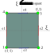

# Quadrangle

## Four-node quadrangle element

## Nine-node quadrangle element

## Sixteen-node quadrangle element

## Element with straight edge

## Isoparametric elements

## Master element

{#fig-master-quadrangle}

## Tensor-product based basis

If we have higher order polynomial family in one dimension, then by using tensor product we can construct the higher order polynomial basis on quadrangle. Following points are noteworthy.

- In each dimension we can have different order of interpolation
- In each dimension we can have different family of polynomials
- We can also construct the nodal Lagrange polynomials.

Let $\mathcal{P}_{p}\left(e\right)$ denotes the space of polynomials of the order of at most $p$, defined on one-dimensional interval $e$.

Usually,

- $e=\left[-1,1\right]$, that is, biunit interval, or
- $e=\left[0,1\right]$, that is, unit interval.

Let ${\bf k}=\left(k_{1},k_{2}\right)$, then we defined the following polynomial space on $\mathcal{Q}$:

$$
\mathcal{Q}_{p,q}=\left\{ \xi_{1}^{i}\xi_{2}^{j} \vert 0 \le i \le p, 0 \le j \le q\right\}
$$

then, $\phi_{k1,k2}\in \mathcal{Q}_{p,q}$

$$
\phi_{k1,k2}\left(\xi_{1},\xi_{2}\right):=\psi_{k_{1}}^{a}\left(\xi_{1}\right)\psi_{k_{2}}^{a}\left(\xi_{2}\right)
$$

where,

- $\psi_{k_{1}}$ and $\phi_{k1,k2}$ has order $k_{1}$ in $\xi_{1}$ direction, and
- $\psi_{k_{2}}$ and $\phi_{k1,k2}$ has order $k_{2}$ in $\xi_{2}$ direction.

These polynomials form the basis of $\mathcal{Q}_{p,q}$, that is:

$$
\mathcal{Q}_{p,q}=\left\{ \phi_{k1,k2}\left(\xi_{1},\xi_{2}\right)\vert 0 \le k_{1}\le p,0\le k_{2}\le q\right\}
$$

:::{.callout-note appearance="simple"}
The dimension of $Q_{p,q}$ is $\left(p+1\right)\left(q+1\right)$.
:::

$$
\phi_{{\bf k}}\left(\xi,\eta\right)=\phi_{k_{1}}\left(\xi\right)\phi_{k_{2}}\left(\eta\right)
$$

### Polynomials space

- [ ] TODO Add Pascal triangle

### Examples

{#fig-lobatto-poly-quadrangle width=80%}

{#fig-legendre-poly-quadrangle width=80%}

@fig-lobatto-poly-quadrangle shows the basis of $\mathcal{Q}_{4,4}$ for Lobatto polynomials.
@fig-legendre-poly-quadrangle shows the basis of $\mathcal{Q}_{4,4}$ for Legendre polynomials.

## Hierarchic basis

In Heirarchical basis, we decompose the basis function in terms of vertex, facet, and cell basis. This type of decomposition is particularly convenient when a $C^{0}$ global expansion base is required since a global expansion can be generated from the local expansion simply by matching the shape fo individual boundary modes.

To construct the heirarchical basis, following notations will be used:

- Inside the element, in the $\xi_{1}$ direction, the maximum polynomial order is denoted by $p^{b}$
- Inside the element, in $\xi_{2}$ direction, the maximum polynomial order is denoted by $q^{b}$
- At horizontal edges, $e_{3}$ and $e_{4}$, the maximum polynomial order will be denoted by $p^{e_{3}}$ and $p^{e_{4}}$, respectively.
- At vertical edges, $e_{1}$ and $e_{2}$, the maximum polynomial order will be denoted by $q^{e_{1}}$ and $q^{e_{2}}$, respectively.

:::{.callout-note appearance="simple"}
On the master element we have,

$$
p^{e_{3}},p^{e_{4}}\le p^{b}
$$

and

$$
q^{e_{1}},q^{e_{2}}\le q^{b}
$$
:::

These local orders of approximation determine that a finite element of the form

$$
\mathcal{K}_{q}^{1}=\left(K_{q},W_{q},\sum_{q}^{1}\right)
$$

has to be equipped with a polynomial space:

$$
W_{q}=\left\{ w\in \mathcal{Q}_{p^{b},q^{b}};w\vert_{e_{j}}\in\mathcal{P}_{p^{e_{j}}}\left(e_{j}\right),j=1,2,3,4\right\}
$$

Let

$$
l_{0}\left(x\right)=\frac{1}{2}\left(1-x\right)
$$

$$
l_{1}\left(x\right)=\frac{1}{2}\left(1+x\right)
$$

$$
l_{m}(x)=-l_{0}(x)l_{1}(x)\frac{\sqrt{2\left(2m-1\right)}}{m-1}P_{m-2}^{\left(1,1\right)}(x),\quad m\ge2
$$

or

$$
l_{m}(x)=-l_{0}(x)l_{1}(x)\frac{\sqrt{8\left(2m-1\right)}}{m\left(m-1\right)}P_{m-2}^{(3/2)}\left(x\right),\quad m\ge2
$$

where, $P_{m-2}^{1,1}$ is the Jacobi polynomial of order $m-2$, and $P_{m-2}^{(3/2)}$ is the Ultraspherical polynomial of order $m-2$.

### Master element

Master element for quadrangle is a little different than the master element for Lagrange polynomials.

### Vertex functions

There are four vertex basis in a quadrangle corresponding to each vertex. The vertex basis corresponding to a vertex $v_{i}$ will be denoted by $\phi_{q}^{v_{i}}$. This basis function vanishes at all remaining vertices $v_{j}, j=1, \cdots, 4, j \ne i$.

:::{.callout-note appearance="simple"}
Vertex basis are linear in $\xi_{1}$, $\xi_{2}$.
:::

$$
\phi_{q}^{v_{1}}\left(\xi_{1},\xi_{2}\right)=l_{0}\left(\xi_{1}\right)l_{0}\left(\xi_{2}\right)
$$

$$
\phi_{q}^{v_{2}}\left(\xi_{1},\xi_{2}\right)=l_{1}\left(\xi_{1}\right)l_{0}\left(\xi_{2}\right)
$$

$$
\phi_{q}^{v_{3}}\left(\xi_{1},\xi_{2}\right)=l_{1}\left(\xi_{1}\right)l_{1}\left(\xi_{2}\right)
$$

$$
\phi_{q}^{v_{4}}\left(\xi_{1},\xi_{2}\right)=l_{0}\left(\xi_{1}\right)l_{1}\left(\xi_{2}\right)
$$

### Edge bubble functions

$$
\phi_{k_{2},q}^{e_{1}}\left(\xi_{1},\xi_{2}\right)=l_{0}\left(\xi_{1}\right)l_{k_{2}}\left(\xi_{2}\right),k_{2}=2,3,\cdots,q^{e_{1}}
$$

$$
\phi_{k_{2},q}^{e_{2}}\left(\xi_{1},\xi_{2}\right)=l_{1}\left(\xi_{1}\right)l_{k_{2}}\left(\xi_{2}\right),k_{2}=2,3,\cdots,q^{e_{2}}
$$

$$
\phi_{k_{1},q}^{e_{3}}\left(\xi_{1},\xi_{2}\right)=l_{k_{1}}\left(\xi_{1}\right)l_{0}\left(\xi_{2}\right),k_{1}=2,3,\cdots,p^{e_{3}}
$$

$$
\phi_{k_{1},q}^{e_{4}}\left(\xi_{1},\xi_{2}\right)=l_{k_{1}}\left(\xi_{1}\right)l_{1}\left(\xi_{2}\right),k_{1}=2,3,\cdots,p^{e_{4}}
$$

:::{.callout-note appearance="simple"}
The number of function on $e_{1},e_{2},e_{3},e_{4}$ are $q^{e_{1}}-1$, $q^{e_{2}}-1$, $p^{e_{3}}-1$, and $p^{e_{4}}-1$. Therefore, for edge bubble function to exist, $p^{e_3}$, $p^{e_4}$, $q^{e_1}$, and $q^{e_2}$ should be greater than or equal to 2.
:::

### Cell Bubble functions

$$
\phi_{k_{1},k_{2},q}^{b}\left(\xi_{1},\xi_{2}\right)=l_{k_{1}}\left(\xi_{1}\right)l_{k_{2}}\left(\xi_{2}\right),2\le k_{1}\le p^{b},2\le k_{2}\le q^{b}
$$

Therefore, inorder to construct a higher order polynomial space on quadrangle, we need to specify, $q^{e_{1}},q^{e_{2}},p^{e_{3}},p^{e_{4}}$,$p^{b}$ and $q^{b}$, with $p^{e_{3}},p^{e_{4}}\le p^{b}$ and $q^{e_{1}},q^{e_{2}}\le q^{b}$.

### Heirarchical degrees of freedom

- Total vertex function $4$
- Total number of edge bubble function $p^{e_{3}}+p^{e_{4}}+q^{e_{1}}+q^{e_{2}}-4$
- Total number of cell bubble function $\left(p^{b}-1\right)\times\left(q^{b}-1\right)$

:::{.callout-tip appearance="simple"}
The local order of approximation $p^{b}$, $q^{b}$, $p^{e_{3}}$, $p^{e_4}$, $q^{e_1}$, and $q^{e_2}$ should obey the minimum rule for $H^1$-conforming approximation. This rule states that the polynomial order assigned to an edge in the physical mesh is equal to the minimum of appropriate directional orders in the interior of adjacent elements.
:::

:::{.callout-note title="Minimum rule for $H^{1}$ conforming approximation" } 

$$
p^{e_3}, p^{e_4} \le p^{b}
$$

$$
q^{e_1}, q^{e_2} \le q^{b}
$$

:::

## Affine coordinates

For the master element we can define following affine coordinates:

$$
\lambda_{1} = \frac{\xi_{1} + 1}{2}
$$

$$
\lambda_{2} = \frac{1- \xi_{1} }{2}
$$

$$
\lambda_{3} = \frac{\xi_{2} + 1}{2}
$$

$$
\lambda_{4} = \frac{1- \xi_{2} }{2}
$$

Then, it is convenient to write the shape function in terms of affine coordinates by using:

$$
\xi_{1} = \lambda_{1} - \lambda_{2}
$$

$$
\xi_{2} = \lambda_{3} - \lambda_{4}
$$

> It is advantageous to describe the shape functions in terms of affine coordinates as they are invariants with respect to the affine transformation of the reference domain.

## Serendipity basis