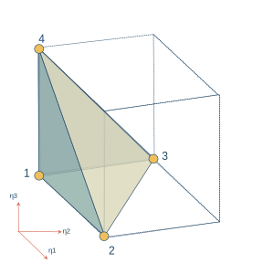
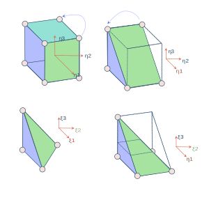
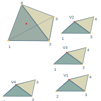

# Tetrahedron

## Four node tetrahedron

## Ten node tetrahedron

## Straight edge tetrahedron

## Isoparametric tetrahedron

## Serendipity tetrahedron

## Lagrange basis

Let's us denote the basis function on tetrahedron element by $\phi_{j}$.
Let's us denote the interpolation points by $\mathbf{x}_{i}$
Then, the Lagrange polynomials are given by:

$$
l_{i} = \sum_{j}{c_{j, i} \phi_{j}}
$$

The coefficients are selected by using following properties of Lagrange polynomials.

$$
l_{i}(\mathbf{x}_{j}) = \delta_{ij}
$$

The Vandermonde matrix for basis $\phi_{j}$ and interpolation points $x_i$ is given below.

$$
\mathbf{V}(i, j) = \phi_{j}(\mathbf{x}_i)
$$

Then, the coefficients are given by

$$
\mathbf{C}= \mathbf{V}^{-1}
$$

:::{.callout-note appearance="simple"}
The $j$th column of C denotes the coefficients for $j$th Lagrange polynomial.
:::

:::{.callout-tip appearance="simple"}
Lagrange polynomials depends upon the interpolation points and the basis functions. The basis function can be given by simple monomials, orthogonal polynomials, or hierarchical polynomials.
:::

## Monomial based Lagrange polynomials

The monomial based basis functions are given by

$$
\mathcal{P}_{N}=\left\{ x_{1}^{i}x_{2}^{j}x_{3}^{k} :0\le i,j,k;i+j+k\le N\right\}
$$

## Master elements

### Bi-unit tetrahedron

For orthogonal polynomials and hierarchical polynomials the master element is given by bi-unit tetrahedron $K_{T}$, which is defined by

$$
K_{T}:=\left\{ \left(\xi_{1},\xi_{2},\xi_{3}\right);-1\le\xi_{1},\xi_{2},\xi_{3},\xi_{1}+\xi_{2}+\xi_{3}\le-1\right\}
$$

{#fig-master-tetrahedron width=50%}

The nodal coordinates of a bi-unit tetrahedron are given in following table.

| node number | $x_1$ | $x_2$ | $x_3$ |
| --- | --- | --- | --- |
| 1 | -1 | -1 | -1 |
| 2 | 1 | -1 | -1 |
| 3 | -1 | 1 | -1 |
| 4 | -1 | -1 | 1 |

Orientation of edges:

A tetrahedron has six edges.

- Three edges are along the x, y, and z axis.
- Three edges are in xy, xz, and yz plane.

| edge number | n1| n2 | orientation |
| --- | --- | --- | --- |
| 1 | 1 | 2 |  $x$ |
| 2 | 1 | 3 |  $y$ |
| 3 | 1 | 4 |  $z$ |
| 4 | 2 | 3 |  $xy$ plane |
| 5 | 2 | 4 |  $xz$ plane |
| 6 | 3 | 4 |  $yz$ plane |

Orientation of faces:

A tetrahedron has four faces.

- Three faces makes xy, xz, and yz plane.
- One face is has its nodes on x, y, and z axis.

| face number | n1| n2 | n3 |  orientation |
| --- | --- | --- | --- | --- |
| 1 | 1 | 2 | 3  | $xy$ plane |
| 2 | 1 | 2 | 4  | $xz$ plane |
| 3 | 1 | 3 | 4  | $yz$ plane |
| 4 | 2 | 3 | 4  | NA |

### Unit tetrahedron

Unit tetrahedron is used as a reference element for constructing Lagrange polynomials on the tetrahedron. The unit tetrahedron is give by

$$
K_{T}:=\left\{ \left(\xi_{1},\xi_{2},\xi_{3}\right);\xi_{1},0 \le \xi_{2},\xi_{3} \le 1,\xi_{1}+\xi_{2}+\xi_{3} \le 1\right\}
$$

The coordinates of the unit tetrahedron are given by following table.

| node number | $x_1$ | $x_2$ | $x_3$ |
| --- | --- | --- | --- |
| 1 | 0 | 0 | 0 |
| 2 | 1 | 0 | 0 |
| 3 | 0 | 1 | 0 |
| 4 | 0 | 0 | 1 |

:::{.callout-note appearance="simple"}
The orientation of edges and facets are same as bi-unit tetrahedron.
:::

### Mapping from bi-unit tetrahedron to unit tetrahedron

Let us denote the coordinates in bi-unit tetrahedron by $(x_b, y_b, z_b)$ and unit tetrahedron by $(x_u, y_u, z_u)$.

Then the mapping from $(x_b, y_b, z_b) \mapsto (x_u, y_u, z_u)$ is given by,

$$
x_{u}=\frac{1}{2}\left(1+x_{b}\right)
$$

$$
y_{u}=\frac{1}{2}\left(1+y_{b}\right)
$$

$$
z_{u}=\frac{1}{2}\left(1+z_{b}\right)
$$

### Mapping from unit tetrahedron to bi-unit tetrahedron

The mapping from $(x_u, y_u, z_u) \mapsto (x_b, y_b, z_b)$ is given by,

$$
x_{b}=2x_{u}-1
$$

$$
y_{b}=2y_{u}-1
$$

$$
z_{b}=2z_{u}-1
$$

## Collapsed Coordinates

Let us denote the coordinates in bi-unit hexahedron coordinates (collapsed coordinates) by $\eta_1, \eta_2, \eta_3$. Let the coordinates in bi-unit tetrahedron be $\xi_1, \xi_2, \xi_3$.

{#fig-tetrahedron-collapsed-coordinates width=50%}

### Mapping between tetrahedron and hexahedron

The mapping between **bi-unit** tetrahedron and **bi-unit** hexahedron is discussed in this section. The collapsed coordinates are given by:

$$
\eta_{1}=-\frac{2+2\xi_{1}+\xi_{2}+\xi_{3}}{\xi_{2}+\xi_{3}}
$$

$$
\eta_{2}=\frac{1+2\xi_{2}+\xi_{3}}{1-\xi_{3}}
$$

$$
\eta_{3}=\xi_{3}
$$

When $\xi_2 + \xi_3 \rightarrow 0$, then $\xi_{1} \rightarrow -1$, and

$$
\eta_{1} \rightarrow -1
$$

Similarly, when $\xi_{3} \rightarrow 1$, then $\xi_{2} \rightarrow -1$, and

$$
\eta_{2} \rightarrow -1
$$

#### Jacobian

$$
\frac{\partial\eta_{1}}{\partial\xi_{1}}=\frac{-2}{\xi_{2}+\xi_{3}}
$$

$$
\frac{\partial\eta_{1}}{\partial\xi_{2}}=\frac{2+2\xi_{1}}{\left(\xi_{2}+\xi_{3}\right)^{2}}
$$

$$
\frac{\partial\eta_{1}}{\partial\xi_{3}}=\frac{2+2\xi_{1}}{\left(\xi_{2}+\xi_{3}\right)^{2}}
$$

$$
\frac{\partial\eta_{2}}{\partial\xi_{1}}=0
$$

$$
\frac{\partial\eta_{2}}{\partial\xi_{2}}=\frac{2}{1-\xi_{3}}
$$

$$
\frac{\partial\eta_{2}}{\partial\xi_{3}}=\frac{1}{\left(1-\xi_{3}\right)^{2}}
$$

$$
\frac{\partial\eta_{3}}{\partial\xi_{1}}=0
$$

$$
\frac{\partial\eta_{3}}{\partial\xi_{2}}=0
$$

$$
\frac{\partial\eta_{3}}{\partial\xi_{3}}=1
$$

### Mapping from hexahedron to tetrahedron

The **inverse of mapping** is given by:

$$
\xi_{1}=\frac{\left(1+\eta_{1}\right)\left(1-\eta_{2}\right)\left(1-\eta_{3}\right)}{4}-1
$$

$$
\xi_{2}=\frac{\left(1+\eta_{2}\right)\left(1-\eta_{3}\right)}{2}-1
$$

$$
\xi_{3}=\eta_{3}
$$

The Jacobian of the above mapping is given by following expression.

$$
\left[\frac{\partial\xi_{i}}{\partial\eta_{j}}\right]=\left[\begin{array}{ccc}
\frac{\left(1-\eta_{2}\right)\left(1-\eta_{3}\right)}{4} & \frac{-\left(1+\eta_{1}\right)\left(1-\eta_{3}\right)}{4} & \frac{-\left(1+\eta_{1}\right)\left(1-\eta_{2}\right)}{4}\\
0 & \frac{\left(1-\eta_{3}\right)}{2} & \frac{-\left(1+\eta_{2}\right)}{2}\\
0 & 0 & 1
\end{array}\right]
$$

The determinant of the Jacobian is given by:

$$
\det\left(\frac{\partial\xi_{i}}{\partial\eta_{j}}\right)=\frac{\left(1-\eta_{2}\right)\left(1-\eta_{3}\right)^{2}}{8}
$$

### Gradients

$$
\begin{aligned}\frac{\partial\phi}{\partial\xi_{1}} & =\frac{\partial\phi}{\partial\eta_{1}}\frac{\partial\eta_{1}}{\partial\xi_{1}}+\frac{\partial\phi}{\partial\eta_{2}}\frac{\partial\eta_{2}}{\partial\xi_{1}}+\frac{\partial\phi}{\partial\eta_{3}}\frac{\partial\eta_{3}}{\partial\xi_{1}}\\
 & =\frac{-2}{\xi_{2}+\xi_{3}}\frac{\partial\phi}{\partial\eta_{1}}
\end{aligned}
$$

$$
\frac{\partial\phi}{\partial\xi_{2}}=\frac{2+2\xi_{1}}{\left(\xi_{2}+\xi_{3}\right)^{2}}\frac{\partial\phi}{\partial\eta_{1}}+\frac{2}{1-\xi_{3}}\frac{\partial\phi}{\partial\eta_{2}}
$$

$$
\frac{\partial\phi}{\partial\xi_{3}}=\frac{2\left(1+\xi_{1}\right)}{\left(\xi_{2}+\xi_{3}\right)^{2}}\frac{\partial\phi}{\partial\eta_{1}}+\frac{1}{\left(1-\xi_{3}\right)^{2}}\frac{\partial\phi}{\partial\eta_{2}}+\frac{\partial\phi}{\partial\eta_{3}}
$$

### Orthogonality of basis functions

In this section we will prove the orthogonality of the basis functions. Consider the following integral.

$$
\int_{\Omega_{\xi}}\phi_{pqr}\left(\xi_{i}\right)\psi_{ijk}\left(\xi_{i}\right)d\xi_{i}
$$

Where $\Omega_{\xi}$ denotes the domain of bi-unit tetrahedron.

$$
\int_{\Omega_{\xi}}:=\int_{-1}^{1}\int_{-1}^{-\xi_{2}}\int_{-1}^{-1-\xi_{2}-\xi_{3}}
$$
 
$$
\xi_{i}:=\left(\xi_{1},\xi_{2},\xi_{3}\right)
$$

$$
d\xi_{i}=d\xi_{1}d\xi_{2}d\xi_{3}
$$

Then, 

$$
\begin{aligned}\int_{\Omega_{\xi}}\phi_{pqr}\left(\xi_{i}\right)\psi_{ijk}\left(\xi_{i}\right)d\xi_{i}=\\
\int_{\Omega_{\eta}}\widetilde{\psi}_{p}^{a}\left(\eta_{1}\right)\widetilde{\psi}_{pq}^{b}\left(\eta_{2}\right)\widetilde{\psi}_{pqr}^{c}\left(\eta_{3}\right) & \widetilde{\psi}_{i}^{a}\left(\eta_{1}\right)\widetilde{\psi}_{jk}^{b}\left(\eta_{2}\right)\widetilde{\psi}_{ijk}^{c}\left(\eta_{3}\right)J_{\xi\eta}d\eta_{i}\\
=\int_{-1}^{+1}\widetilde{\psi}_{p}^{a}\left(\eta_{1}\right)\widetilde{\psi}_{i}^{a}\left(\eta_{1}\right)\int_{-1}^{+1}\widetilde{\psi}_{pq}^{b}\left(\eta_{2}\right)\widetilde{\psi}_{ij}^{b}\left(\eta_{2}\right) & \int_{-1}^{+1}\widetilde{\psi}_{pqr}^{c}\left(\eta_{3}\right)\widetilde{\psi}_{ijk}^{c}\left(\eta_{3}\right)
\end{aligned}
$$

Where,

$$
\int_{\Omega_{\eta}}:=\int_{-1}^{1}\int_{-1}^{+1}\int_{-1}^{+1}
$$

$$
d\eta_{i}=d\eta_{1}d\eta_{2}d\eta_{3}
$$

$$
J_{\xi\eta}=\det\left(\frac{\partial\xi_{i}}{\partial\eta_{j}}\right)=\frac{\left(1-\eta_{2}\right)\left(1-\eta_{3}\right)^{2}}{8}
$$

The first integral is orthogonal due to orthogonality of Legendre polynomials. Therefore, this integral is zero when $p\ne i$, and it is nonzero when $p=i$.

$$
\int_{-1}^{+1}\widetilde{\psi}_{p}^{a}\left(\eta_{1}\right)\widetilde{\psi}_{i}^{a}\left(\eta_{1}\right)=\int_{-1}^{+1}P_{p}^{0,0}\left(\eta_{1}\right)P_{i}^{0,0}\left(\eta_{1}\right)
$$

The second integral is orthogonal when $p=i$, due to orthogonality of Jacobi polynomial (with $\alpha=2p+1$ and $\beta=0$). Therefore, when $p=i$, the second integral is zero when $q \ne j$.

$$
\begin{aligned}\int_{-1}^{+1}\widetilde{\psi}_{pq}^{b}\left(\eta_{2}\right)\widetilde{\psi}_{ij}^{b}\left(\eta_{2}\right)\left(\frac{1-\eta_{2}}{2}\right) & =\int_{-1}^{+1}P_{q}^{2p+1,0}\left(\eta_{2}\right)P_{j}^{2i+1,0}\left(\eta_{2}\right)\left(\frac{1-\eta_{2}}{2}\right)^{p+i+1}\end{aligned}
$$

The third integral is orthogonal when $p=i$ and $q=j$ due to the orthogonality of Jacobi polynomials (with $\alpha=2p+2q+2$ and $\beta=0$).

$$
\int_{-1}^{+1}\widetilde{\psi}_{pqr}^{c}\left(\eta_{3}\right)\widetilde{\psi}_{ijk}^{c}\left(\eta_{3}\right)\left(\frac{1-\eta_{3}}{2}\right)^{2}=\int_{-1}^{+1}P_{r}^{2p+2q+2,0}\left(\eta_{3}\right)P_{k}^{2i+2j+2,0}\left(\eta_{3}\right)\left(\frac{1-\eta_{3}}{2}\right)^{p+q+i+j+2}
$$

In this way the basis functions are orthogonal. They are nonzero when $\left(p,q,r\right)=\left(i,j,k\right)$. They are zero when $\left(p,q,r\right)\ne\left(i,j,k\right)$.

Note that in the case of full tensor-product basis functions on the quadrangle and the hexahedron the basis functions are orthogonal in each direction. However, in the case of warped tensor-product basis functions, the basis functions are orthogonal in $\eta_{1}$ direction. This supports the orthogonality of basis function in $\eta_{2}$ direction. Which in turn, supports the orthogonality of the basis functions in $\eta_{3}$ direction.

### Tensor product numerical quadrature

$$
\begin{aligned}\int_{\Omega_{\xi}}f\left(\xi_{1},\xi_{2},\xi_{3}\right)d\xi & =\frac{1}{8}\int_{\Omega_{\eta}}f\left(\eta_{1},\eta_{2},\eta_{3}\right)\left(1-\eta_{2}\right)\left(1-\eta_{3}\right)^{2}d\eta\\ & =\frac{1}{8}\sum_{i=1}^{n}f\left(\eta_{1}^{i},\eta_{2}^{i},\eta_{3}^{i}\right)w^{i} \end{aligned}
$$

- Select $N+1$ Gauss Legendre Lobatto points in $\eta_{1}$.
- $N$ Gauss Jacobi Radau (left) points in $\eta_{2}$ with $\alpha=1$ and $\beta=0$.
- Select $N$ Gauss Jacobi Radau (left) points in $\eta_{3}$ with $\alpha=2$ and $\beta=0$.

## Barycentric coordinates

Barycentric coordinates of tetrahedron are also called the volume coordinates. They are represented by $l_1$, $l_2$, $l_3$, and $l_4$.

$$
\lambda_{i} = \frac{V_1}{V}, i=1,2,3,4
$$

Where,
$$
V = V_1 + V_2 + V_3 + V_4,
$$
denotes the volume of tetrahedron.

The surface which is in front of the node-1 will be denoted by $s_1$, in this way, the surface in front of the node $j$, will be denoted by $s_j$.

The surface $s_{i}$ contains all node but $i^{th}$ node.

The volume of small tetrahedron formed by surface $s_i$ and an internal point is denoted by $V_{i}$, and the ratio $V_{i}/V$ is the volume coordinate $\lambda_{i}$ of that internal point. This concept is depicted in figure given below.

{#fig-tetrahedron-barycentric-coord width=50%}

The barycentric coordinates satisfies the following relationships:

$$
\lambda_{1} + \lambda_{2} + \lambda_{3} + \lambda_{4} = 1
$$

### Bi-unit tetrahedron

The barycentric coordinates of a bi-unit tetrahedron are given below.

$$
\lambda_{1}=-\frac{\left(1+\xi_{1}+\xi_{2}+\xi_{3}\right)}{2}
$$

$$
\lambda_{2}=\frac{1+\xi_{1}}{2}
$$

$$
\lambda_{3}=\frac{1+\xi_{2}}{2}
$$

$$
\lambda_{4}=\frac{1+\xi_{3}}{2}
$$

The Jacobian of the mapping is given below.

$$
\frac{\partial \lambda_{i}}{\partial\xi_{j}}=\left[\begin{array}{ccc}
-\frac{1}{2} & -\frac{1}{2} & -\frac{1}{2}\\
\frac{1}{2} & 0 & 0\\
0 & \frac{1}{2} & 0\\
0 & 0 & \frac{1}{2}
\end{array}\right]
$$

Also,

$$
\frac{\partial\phi}{\partial\xi_{1}}=\frac{1}{2}\frac{\partial\phi}{\partial \lambda_{2}}-\frac{1}{2}\frac{\partial\phi}{\partial \lambda_{1}}
$$

$$
\frac{\partial\phi}{\partial\xi_{2}}=\frac{1}{2}\frac{\partial\phi}{\partial \lambda_{3}}-\frac{1}{2}\frac{\partial\phi}{\partial \lambda_{1}}
$$

$$
\frac{\partial\phi}{\partial\xi_{3}}=\frac{1}{2}\frac{\partial\phi}{\partial \lambda_{4}}-\frac{1}{2}\frac{\partial\phi}{\partial \lambda_{1}}
$$

### Unit tetrahedron

The barycentric coordinates of a unit tetrahedron are given below.

$$
\lambda_{1} = 1 - \xi_{1} - \xi_{2 } - \xi_{3}
$$

$$
\lambda_{2} = \xi_{1}
$$

$$
\lambda_{3} = \xi_{2}
$$

$$
\lambda_{4} = \xi_{3}
$$

The Jacobian of the mapping is given below. 

$$
\frac{\partial \lambda_{i}}{\partial\xi_{j}}=\left[\begin{array}{ccc}
-1 & -1 & -1\\
1 & 0 & 0\\
0 & 1 & 0\\
0 & 0 & 1
\end{array}\right]
$$

Also,

$$
\frac{\partial\phi}{\partial\xi_{1}}=-\frac{\partial\phi}{\partial \lambda_{1}}+\frac{\partial\phi}{\partial \lambda_{2}}
$$

$$
\frac{\partial\phi}{\partial\xi_{2}}=-\frac{\partial\phi}{\partial \lambda_{1}}+\frac{\partial\phi}{\partial \lambda_{3}}
$$

$$
\frac{\partial\phi}{\partial\xi_{3}}=-\frac{\partial\phi}{\partial \lambda_{1}}+\frac{\partial\phi}{\partial \lambda_{4}}
$$

### Collapsed coordinates and Barycentric coordinates

The following expression describes the collapsed coordinates in terms of the barycentric coordinates.

$$
\eta_{1}=\frac{\lambda_{2}-\lambda_{1}}{1-\lambda_{3}-\lambda_{4}}
$$

$$
\eta_{2}=\frac{2\lambda_{3}}{1-\lambda_{4}}-1
$$

$$
\eta_{3}=2\lambda_{4}-1
$$

## Orthogonal basis

### Collapsed coordinates

The Orthogonal basis in terms of collapsed coordinates is given by following expressions.

$$
\phi_{pqr}\left(\xi_{1},\xi_{3},\xi_{3}\right)=\widetilde{\psi}_{p}^{a}\left(\eta_{1}\right)\widetilde{\psi}_{pq}^{b}\left(\eta_{2}\right)\widetilde{\psi}_{pqr}^{c}\left(\eta_{3}\right)
$$

Here, $\widetilde{\psi}_{p}^{a}$, $\widetilde{\psi}_{pq}^{b}$, and $\widetilde{\psi}_{pqr}^{c}$ are referred to as orthogonal principal functions.

$$
\widetilde{\psi}_{p}^{a}\left(x\right)=P_{p}^{0,0}\left(x\right)
$$

$$
\widetilde{\psi}_{pq}^{b}\left(x\right)=\left(\frac{1-x}{2}\right)^{p}P_{q}^{2p+1,0}\left(x\right)
$$

$$
\widetilde{\psi}_{pqr}^{b}\left(x\right)=\left(\frac{1-x}{2}\right)^{p+q}P_{r}^{2p+2q+2,0}\left(x\right)
$$

$$
\phi_{pqr}=P_{p}^{0,0}\left(\eta_{1}\right)\left(\frac{1-\eta_{2}}{2}\right)^{p}P_{q}^{2p+1,0}\left(\eta_{2}\right)\left(\frac{1-\eta_{3}}{2}\right)^{p+q}P_{r}^{2p+2q+2,0}\left( \eta_{3} \right)
$$

Therefore, for $n^{th}$ order approximation, we have the following values of $p,q,r$.

$$
\left \{  (p,q,r); 0 \le p,q,r \le n; p+q+r \le n \right \}
$$

### Example

For second order tetrahedron, we have 10 degrees of freedom (i.e., the number of basis functions). These basis functions are given below (in terms of $\xi_1$ and $\xi_2$). 

$$
\psi_1 := \phi_{0,0,0}=1
$$

$$
\psi_2 := \phi_{0,0,1}=4\xi_3-1
$$

$$
\psi_3 := \phi_{0,0,2}=15 \xi_{3}^{2} - 10\xi_{3} + 1
$$

$$
\psi_4 := \phi_{0,1,0}=3\xi_2+\xi_3-1
$$

$$
\psi_5 := \phi_{0,1,1} = 6 \xi_{3}^{2} + 18 \xi_{2} \xi_{3} - 3 \xi_{2} - 7 \xi_{3} + 1
$$

$$
\psi_6 := \phi_{0,2,0}= 10 \xi_{2}^{2} + \xi_{3}^{2} + 8 \xi_{2} \xi_{3} - 8 \xi_{2} - 2 \xi_{3} + 1
$$

$$
\psi_7 := \phi_{1,0,0}=2\xi_1+\xi_2+\xi_3-1
$$

$$
\psi_8 := \phi_{1,0,1}=6 \xi_{3}^{2} + 12 \xi_{1} \xi_{3} + 6 \xi_{2} \xi_{3} - 2 \xi_{1} -  \xi_{2} -7 \xi_{3} + 1
$$

$$
\psi_9 := \phi_{1,1,0}=5 \xi_{2}^{2} + \xi_{3}^{2} + 10 \xi_{1} \xi_{2} + 2 \xi_{1} \xi_{3} + 6 \xi_{2} \xi_{3} -  2 \xi_{1} - 6 \xi_{2} - 2 \xi_{3} + 1
$$

$$
\psi_{10} := \phi_{2,0,0}=6\xi_{1}^{2} + \xi_{2}^{2} + \xi_{3}^{2} + 6\xi_{1} \xi_{2} + 6 \xi_{1} \xi_{3} + 2 \xi_{2} \xi_{3} - 6 \xi_{1} - 2 \xi_{2} -2 \xi_{3} + 1
$$

### Gradient of Orthogonal polynomial

$$
\begin{aligned}\frac{\partial\phi_{pqr}}{\partial\eta_{1}} & =\frac{\partial P_{p}^{0,0}\left(\eta_{1}\right)}{\partial\eta_{1}}\left(\frac{1-\eta_{2}}{2}\right)^{p}P_{q}^{2p+1,0}\left(\eta_{2}\right)\left(\frac{1-\eta_{3}}{2}\right)^{p+q}P_{r}^{2p+2q+2,0}\left(\eta_{3}\right)\end{aligned}
$$

$$
\begin{aligned}\frac{\partial\phi_{pqr}}{\partial\eta_{2}} & =P_{p}^{0,0}\left(\eta_{1}\right)\\
 & \times\left\{ -\frac{p}{2}\left(\frac{1-\eta_{2}}{2}\right)^{p-1}P_{q}^{2p+1,0}\left(\eta_{2}\right)+\left(\frac{1-\eta_{2}}{2}\right)^{p}\frac{\partial}{\partial\eta_{2}}P_{q}^{2p+1,0}\left(\eta_{2}\right)\right\} \\
 & \times\left(\frac{1-\eta_{3}}{2}\right)^{p+q}P_{r}^{2p+2q+2,0}\left(\eta_{3}\right)
\end{aligned}
$$

$$
\begin{aligned}\frac{\partial\phi_{pqr}}{\partial\eta_{3}} & =P_{p}^{0,0}\left(\eta_{1}\right)\\
 & \times\left(\frac{1-\eta_{2}}{2}\right)^{p}P_{q}^{2p+1,0}\left(\eta_{2}\right)\\
 & \times\left\{ -\left(\frac{p+q}{2}\right)\left(\frac{1-\eta_{3}}{2}\right)^{p+q-1}P_{r}^{2p+2q+2,0}\left(\eta_{3}\right)+\left(\frac{1-\eta_{3}}{2}\right)^{p+q}\frac{\partial}{\partial\eta_{3}}P_{r}^{2p+2q+2,0}\left(\eta_{3}\right)\right\} 
\end{aligned}
$$

We can calculate gradient of orthogonal basis in bi-unit tetrahedron by using following expression.

$$
\frac{\partial\phi}{\partial\xi_{1}}=\frac{-2}{\xi_{2}+\xi_{3}}\frac{\partial\phi}{\partial\eta_{1}}
$$

$$
\frac{\partial\phi}{\partial\xi_{2}}=\frac{2+2\xi_{1}}{\left(\xi_{2}+\xi_{3}\right)^{2}}\frac{\partial\phi}{\partial\eta_{1}}+\frac{2}{1-\xi_{3}}\frac{\partial\phi}{\partial\eta_{2}}
$$

$$
\frac{\partial\phi}{\partial\xi_{3}}=\frac{2\left(1+\xi_{1}\right)}{\left(\xi_{2}+\xi_{3}\right)^{2}}\frac{\partial\phi}{\partial\eta_{1}}+\frac{1}{\left(1-\xi_{3}\right)^{2}}\frac{\partial\phi}{\partial\eta_{2}}+\frac{\partial\phi}{\partial\eta_{3}}
$$

The gradient of orthogonal basis in unit tetrahedron is twice of $\frac{\partial \phi}{\partial \xi_{i}}$.

## Hierarchical Basis in barycentric coordinates

In this section we will discuss how to construct the Hierarchical basis on bi-unit tetrahedron in terms of barycentric coordinates.

### Vertex basis

$$
\phi_{1}^{v} = \lambda_{1}:= -\frac{1+\xi_{1}+\xi_{2}+\xi_{3}}{2}
$$

$$
\phi_{2}^{v} = \lambda_{2} := \frac{1+\xi_{1}}{2}
$$

$$
\phi_{3}^{v} = \lambda_{3} := \frac{1+\xi_{2}}{2}
$$

$$
\phi_{4}^{v} = \lambda_{4} := \frac{1+\xi_{3}}{2}
$$

The gradient of vertex-basis is given below.

$$
\frac{\partial\phi_{i}^{v}}{\partial\lambda_{j}}=\left[\begin{array}{cccc}
1 & 0 & 0 & 0\\
0 & 1 & 0 & 0\\
0 & 0 & 1 & 0\\
0 & 0 & 0 & 1
\end{array}\right]
$$

### Edge basis

#### x-edge

$$
\phi_{1,k}^{e}=\lambda_{1} \lambda_{2} \phi_{k-2}(\lambda_{2}-\lambda_{1}), k \ge 2
$$

Gradients:

$$
\frac{\partial\phi_{1,k}^{e}}{\partial\lambda_{1}}=\lambda_{2}\phi_{k-2}(\lambda_{2}-\lambda_{1})-\lambda_{1}\lambda_{2}\partial\phi_{k-2}(\lambda_{2}-\lambda_{1})
$$

$$
\frac{\partial\phi_{1,k}^{e}}{\partial\lambda_{2}}=\lambda_{1}\phi_{k-2}(\lambda_{2}-\lambda_{1})+\lambda_{1}\lambda_{2}\partial\phi_{k-2}(\lambda_{2}-\lambda_{1})
$$

$$
\frac{\partial\phi_{1,k}^{e}}{\partial\lambda_{3}}=\frac{\partial\phi_{1,k}^{e}}{\partial\lambda_{4}}=0
$$

#### y-edge

$$
\phi_{2,k}^{e}=\lambda_{1} \lambda_{3} \phi_{k-2}(\lambda_{3}-\lambda_{1}), k \ge 2
$$

Gradients:

$$
\frac{\partial\phi_{2,k}^{e}}{\partial\lambda_{1}}=\lambda_{3}\phi_{k-2}(\lambda_{3}-\lambda_{1})-\lambda_{1}\lambda_{3}\partial\phi_{k-2}(\lambda_{3}-\lambda_{1})
$$

$$
\frac{\partial\phi_{2,k}^{e}}{\partial\lambda_{3}}=\lambda_{1}\phi_{k-2}(\lambda_{3}-\lambda_{1})+\lambda_{1} \lambda_{3} \partial\phi_{k-2}(\lambda_{3}-\lambda_{1})
$$

#### z-edge

$$
\phi_{3,k}^{e}=\lambda_{1} \lambda_{4} \phi_{k-2}(\lambda_{4}-\lambda_{1}), k \ge 2
$$

Gradients:

$$
\frac{\partial\phi_{3,k}^{e}}{\partial\lambda_{1}}=\lambda_{4}\phi_{k-2}(\lambda_{4}-\lambda_{1})-\lambda_{1}\lambda_{4}\partial\phi_{k-2}(\lambda_{4}-\lambda_{1})
$$

$$
\frac{\partial\phi_{3,k}^{e}}{\partial\lambda_{4}}=\lambda_{1}\phi_{k-2}(\lambda_{4}-\lambda_{1})+\lambda_{1}\lambda_{4}\partial\phi_{k-2}(\lambda_{4}-\lambda_{1})
$$

#### $xy$ edge

$$
\phi_{4,k}^{e}=\lambda_{2} \lambda_{3} \phi_{k-2}(\lambda_{3}-\lambda_{2}), k \ge 2
$$

Gradients:

$$
\frac{\partial\phi_{4,k}^{e}}{\partial\lambda_{2}}=\lambda_{3}\phi_{k-2}(\lambda_{3}-\lambda_{2})-\lambda_{2}\lambda_{3}\partial\phi_{k-2}(\lambda_{3}-\lambda_{2})
$$

$$
\frac{\partial\phi_{4,k}^{e}}{\partial\lambda_{3}}=\lambda_{2}\phi_{k-2}(\lambda_{3}-\lambda_{2})+\lambda_{2}\lambda_{3}\partial\phi_{k-2}(\lambda_{3}-\lambda_{2})
$$

#### $xz$ edge

$$
\phi_{5,k}^{e}=\lambda_{2} \lambda_{4} \phi_{k-2}(\lambda_{4}-\lambda_{2}), k \ge 2
$$

Gradients:

$$
\frac{\partial\phi_{5,k}^{e}}{\partial\lambda_{2}}=\lambda_{4}\phi_{k-2}(\lambda_{4}-\lambda_{2})-\lambda_{2}\lambda_{4}\partial\phi_{k-2}(\lambda_{4}-\lambda_{2})
$$

$$
\frac{\partial\phi_{5,k}^{e}}{\partial\lambda_{4}}=\lambda_{2}\phi_{k-2}(\lambda_{4}-\lambda_{2})+\lambda_{2}\lambda_{4}\partial\phi_{k-2}(\lambda_{4}-\lambda_{2})
$$

#### $yz$ edge

$$
\phi_{6,k}^{e}=\lambda_{3} \lambda_{4} \phi_{k-2}(\lambda_{4}-\lambda_{3}), k \ge 2
$$

Gradients:

$$
\frac{\partial\phi_{6,k}^{e}}{\partial\lambda_{3}}=\lambda_{4}\phi_{k-2}(\lambda_{4}-\lambda_{3})-\lambda_{3}\lambda_{4}\partial\phi_{k-2}(\lambda_{4}-\lambda_{3})
$$

$$
\frac{\partial\phi_{6,k}^{e}}{\partial\lambda_{4}}=\lambda_{3}\phi_{k-2}(\lambda_{4}-\lambda_{3})+\lambda_{3}\lambda_{4}\partial\phi_{k-2}(\lambda_{4}-\lambda_{3})
$$

### Facet basis

#### Facet 1 ($xy$)

$$
\phi_{1,k}^{f}=\lambda_{1}\lambda_{2}\lambda_{3}\phi_{n_{1}-1}(\lambda_{2}-\lambda_{1})\phi_{n_{2}-1}(\lambda_{3}-\lambda_{1})
$$

Here,

$$
1 \le n_{1}, n_{2},
$$

$$
n_{1}+n_{2} \le p^{s}_{xy}-1,
$$

$$
p_{xy}^{s} \ge 3
$$

Gradients:

$$
\begin{aligned}\frac{\partial\phi_{1,k}^{f}}{\partial\lambda_{1}} & =\lambda_{2}\lambda_{3}\phi_{n_{1}-1}(\lambda_{2}-\lambda_{1})\phi_{n_{2}-1}(\lambda_{3}-\lambda_{1})\\
& -\lambda_{1}\lambda_{2}\lambda_{3}\partial\phi_{n_{1}-1}(\lambda_{2}-\lambda_{1})\phi_{n_{2}-1}(\lambda_{3}-\lambda_{1})\\
& -\lambda_{1}\lambda_{2}\lambda_{3}\phi_{n_{1}-1}(\lambda_{2}-\lambda_{1})\partial\phi_{n_{2}-1}(\lambda_{3}-\lambda_{1})
\end{aligned}
$$

$$
\begin{aligned}\frac{\partial\phi_{1,k}^{f}}{\partial\lambda_{2}} & =\lambda_{1}\lambda_{3}\phi_{n_{1}-1}(\lambda_{2}-\lambda_{1})\phi_{n_{2}-1}(\lambda_{3}-\lambda_{1})\\
& +\lambda_{1}\lambda_{2}\lambda_{3}\partial\phi_{n_{1}-1}(\lambda_{2}-\lambda_{1})\phi_{n_{2}-1}(\lambda_{3}-\lambda_{1})
\end{aligned}
$$

$$
\begin{aligned}\frac{\partial\phi_{1,k}^{f}}{\partial\lambda_{3}} & =\lambda_{1}\lambda_{2}\phi_{n_{1}-1}(\lambda_{2}-\lambda_{1})\phi_{n_{2}-1}(\lambda_{3}-\lambda_{1})\\
& +\lambda_{1}\lambda_{2}\lambda_{3}\phi_{n_{1}-1}(\lambda_{2}-\lambda_{1})\partial\phi_{n_{2}-1}(\lambda_{3}-\lambda_{1})
\end{aligned}
$$

#### Facet 2 ($xz$)

$$
\phi_{2,n_{1},n_{2}}^{f}=\lambda_{1}\lambda_{2}\lambda_{4}\phi_{n_{1}-1}(\lambda_{2}-\lambda_{1})\phi_{n_{2}-1}(\lambda_{4}-\lambda_{1})
$$

Here,

$$
1 \le n_{1}, n_{2},
$$

$$
n_{1}+n_{2} \le p^{s}_{xz}-1
$$

$$
p_{xz}^{s} \ge 3
$$

Gradients

$$
\begin{aligned}\frac{\partial\phi_{2,n_{1},n_{2}}^{f}}{\partial\lambda_{1}} & =\lambda_{2}\lambda_{4}\phi_{n_{1}-1}(\lambda_{2}-\lambda_{1})\phi_{n_{2}-1}(\lambda_{4}-\lambda_{1})\\
& -\lambda_{1}\lambda_{2}\lambda_{4}\partial\phi_{n_{1}-1}(\lambda_{2}-\lambda_{1})\phi_{n_{2}-1}(\lambda_{4}-\lambda_{1})\\
& -\lambda_{1}\lambda_{2}\lambda_{4}\phi_{n_{1}-1}(\lambda_{2}-\lambda_{1})\partial\phi_{n_{2}-1}(\lambda_{4}-\lambda_{1})
\end{aligned}
$$

$$
\begin{aligned}\frac{\partial\phi_{2,n_{1},n_{2}}^{f}}{\partial\lambda_{2}} & =\lambda_{1}\lambda_{4}\phi_{n_{1}-1}(\lambda_{2}-\lambda_{1})\phi_{n_{2}-1}(\lambda_{4}-\lambda_{1})\\
& +\lambda_{1}\lambda_{2}\lambda_{4}\partial\phi_{n_{1}-1}(\lambda_{2}-\lambda_{1})\phi_{n_{2}-1}(\lambda_{4}-\lambda_{1})
\end{aligned}
$$

$$
\begin{aligned}\frac{\partial\phi_{2,n_{1},n_{2}}^{f}}{\partial\lambda_{4}} & =\lambda_{1}\lambda_{2}\phi_{n_{1}-1}(\lambda_{2}-\lambda_{1})\phi_{n_{2}-1}(\lambda_{4}-\lambda_{1})\\
& +\lambda_{1}\lambda_{2}\lambda_{4}\phi_{n_{1}-1}(\lambda_{2}-\lambda_{1})\partial\phi_{n_{2}-1}(\lambda_{4}-\lambda_{1})
\end{aligned}
$$

#### Facet 3 ($yz$)

$$
\phi_{3,n_{1},n_{2}}^{f}=\lambda_{1}\lambda_{3}\lambda_{4}\phi_{n_{1}-1}(\lambda_{3}-\lambda_{1})\phi_{n_{2}-1}(\lambda_{4}-\lambda_{1})
$$

Here,

$$
1 \le n_{1}, n_{2},
$$

$$
n_{1}+n_{2} \le p^{s}_{yz}-1
$$

$$
p_{yz}^{s} \ge 3
$$

Gradients:

$$
\begin{aligned}\frac{\partial}{\partial\lambda_{1}}\phi_{3,n_{1},n_{2}}^{f} & =\lambda_{3}\lambda_{4}\phi_{n_{1}-1}(\lambda_{3}-\lambda_{1})\phi_{n_{2}-1}(\lambda_{4}-\lambda_{1})\\
& -\lambda_{1}\lambda_{3}\lambda_{4}\partial\phi_{n_{1}-1}(\lambda_{3}-\lambda_{1})\phi_{n_{2}-1}(\lambda_{4}-\lambda_{1})\\
& -\lambda_{1}\lambda_{3}\lambda_{4}\phi_{n_{1}-1}(\lambda_{3}-\lambda_{1})\partial\phi_{n_{2}-1}(\lambda_{4}-\lambda_{1})
\end{aligned}
$$

$$
\begin{aligned}\frac{\partial}{\partial\lambda_{3}}\phi_{3,n_{1},n_{2}}^{f} & =\lambda_{1}\lambda_{4}\phi_{n_{1}-1}(\lambda_{3}-\lambda_{1})\phi_{n_{2}-1}(\lambda_{4}-\lambda_{1})\\
& +\lambda_{1}\lambda_{3}\lambda_{4}\partial\phi_{n_{1}-1}(\lambda_{3}-\lambda_{1})\phi_{n_{2}-1}(\lambda_{4}-\lambda_{1})
\end{aligned}
$$

$$
\begin{aligned}\frac{\partial}{\partial\lambda_{4}}\phi_{3,n_{1},n_{2}}^{f} & =\lambda_{1}\lambda_{3}\phi_{n_{1}-1}(\lambda_{3}-\lambda_{1})\phi_{n_{2}-1}(\lambda_{4}-\lambda_{1})\\
& +\lambda_{1}\lambda_{3}\lambda_{4}\phi_{n_{1}-1}(\lambda_{3}-\lambda_{1})\partial\phi_{n_{2}-1}(\lambda_{4}-\lambda_{1})
\end{aligned}
$$

#### Facet 4 ($xyz$)

$$
\phi_{4,n_{1},n_{2}}^{f}=\lambda_{2}\lambda_{3}\lambda_{4}\phi_{n_{1}-1}(\lambda_{3}-\lambda_{2})\phi_{n_{2}-1}(\lambda_{4}-\lambda_{2})
$$

Here,

$$
1 \le n_{1}, n_{2},
$$

$$
n_{1}+n_{2} \le p^{s}_{xyz}-1
$$

$$
p_{xyz}^{s} \ge 3
$$

Gradients:

$$
\begin{aligned}\frac{\partial\phi_{4,n_{1},n_{2}}^{f}}{\partial\lambda_{2}} & =\lambda_{3}\lambda_{4}\phi_{n_{1}-1}(\lambda_{3}-\lambda_{2})\phi_{n_{2}-1}(\lambda_{4}-\lambda_{2})\\
& -\lambda_{2}\lambda_{3}\lambda_{4}\phi_{n_{1}-1}\partial(\lambda_{3}-\lambda_{2})\phi_{n_{2}-1}(\lambda_{4}-\lambda_{2})\\
& -\lambda_{2}\lambda_{3}\lambda_{4}\phi_{n_{1}-1}(\lambda_{3}-\lambda_{2})\partial\phi_{n_{2}-1}(\lambda_{4}-\lambda_{2})
\end{aligned}
$$

$$
\begin{aligned}\frac{\partial\phi_{4,n_{1},n_{2}}^{f}}{\partial\lambda_{3}} & =\lambda_{2}\lambda_{4}\phi_{n_{1}-1}(\lambda_{3}-\lambda_{2})\phi_{n_{2}-1}(\lambda_{4}-\lambda_{2})\\
& +\lambda_{2}\lambda_{3}\lambda_{4}\phi_{n_{1}-1}\partial(\lambda_{3}-\lambda_{2})\phi_{n_{2}-1}(\lambda_{4}-\lambda_{2})
\end{aligned}
$$

$$
\begin{aligned}\frac{\partial\phi_{4,n_{1},n_{2}}^{f}}{\partial\lambda_{4}} & =\lambda_{2}\lambda_{3}\phi_{n_{1}-1}(\lambda_{3}-\lambda_{2})\phi_{n_{2}-1}(\lambda_{4}-\lambda_{2})\\
& +\lambda_{2}\lambda_{3}\lambda_{4}\phi_{n_{1}-1}(\lambda_{3}-\lambda_{2})\partial\phi_{n_{2}-1}(\lambda_{4}-\lambda_{2})
\end{aligned}
$$

### Cell basis

$$
\phi_{n_{1},n_{2},n_{3}}^{b}=\lambda_{1}\lambda_{2}\lambda_{3}\lambda_{4} \phi_{n_{1}-1}(\lambda_{2}-\lambda_{1}) \phi_{n_{2}-1}(\lambda_{3}-\lambda_{1}) \phi_{n_{3}-1}(\lambda_{4}-\lambda_{1})
$$

Gradients:

$$
\begin{aligned}\frac{\partial\phi_{n_{1},n_{2},n_{3}}^{b}}{\partial\lambda_{1}} & =\lambda_{2}\lambda_{3}\lambda_{4}\phi_{n_{1}-1}(\lambda_{2}-\lambda_{1})\phi_{n_{2}-1}(\lambda_{3}-\lambda_{1})\phi_{n_{3}-1}(\lambda_{4}-\lambda_{1})\\
& -\lambda_{1}\lambda_{2}\lambda_{3}\lambda_{4}\partial\phi_{n_{1}-1}(\lambda_{2}-\lambda_{1})\phi_{n_{2}-1}(\lambda_{3}-\lambda_{1})\phi_{n_{3}-1}(\lambda_{4}-\lambda_{1})\\
& -\lambda_{1}\lambda_{2}\lambda_{3}\lambda_{4}\phi_{n_{1}-1}(\lambda_{2}-\lambda_{1})\partial\phi_{n_{2}-1}(\lambda_{3}-\lambda_{1})\phi_{n_{3}-1}(\lambda_{4}-\lambda_{1})\\
& -\lambda_{1}\lambda_{2}\lambda_{3}\lambda_{4}\phi_{n_{1}-1}(\lambda_{2}-\lambda_{1})\phi_{n_{2}-1}(\lambda_{3}-\lambda_{1})\partial\phi_{n_{3}-1}(\lambda_{4}-\lambda_{1})
\end{aligned}
$$

$$
\begin{aligned}\frac{\partial\phi_{n_{1},n_{2},n_{3}}^{b}}{\partial\lambda_{2}} & =\lambda_{1}\lambda_{3}\lambda_{4}\phi_{n_{1}-1}(\lambda_{2}-\lambda_{1})\phi_{n_{2}-1}(\lambda_{3}-\lambda_{1})\phi_{n_{3}-1}(\lambda_{4}-\lambda_{1})\\
& +\lambda_{1}\lambda_{2}\lambda_{3}\lambda_{4}\partial\phi_{n_{1}-1}(\lambda_{2}-\lambda_{1})\phi_{n_{2}-1}(\lambda_{3}-\lambda_{1})\phi_{n_{3}-1}(\lambda_{4}-\lambda_{1})
\end{aligned}
$$

$$
\begin{aligned}\frac{\partial\phi_{n_{1},n_{2},n_{3}}^{b}}{\partial\lambda_{3}} & =\lambda_{1}\lambda_{2}\lambda_{4}\phi_{n_{1}-1}(\lambda_{2}-\lambda_{1})\phi_{n_{2}-1}(\lambda_{3}-\lambda_{1})\phi_{n_{3}-1}(\lambda_{4}-\lambda_{1})\\
& +\lambda_{1}\lambda_{2}\lambda_{3}\lambda_{4}\phi_{n_{1}-1}(\lambda_{2}-\lambda_{1})\partial\phi_{n_{2}-1}(\lambda_{3}-\lambda_{1})\phi_{n_{3}-1}(\lambda_{4}-\lambda_{1})
\end{aligned}
$$

$$
\begin{aligned}\frac{\partial\phi_{n_{1},n_{2},n_{3}}^{b}}{\partial\lambda_{4}} & =\lambda_{1}\lambda_{2}\lambda_{3}\phi_{n_{1}-1}(\lambda_{2}-\lambda_{1})\phi_{n_{2}-1}(\lambda_{3}-\lambda_{1})\phi_{n_{3}-1}(\lambda_{4}-\lambda_{1})\\
& +\lambda_{1}\lambda_{2}\lambda_{3}\lambda_{4}\phi_{n_{1}-1}(\lambda_{2}-\lambda_{1})\phi_{n_{2}-1}(\lambda_{3}-\lambda_{1})\partial\phi_{n_{3}-1}(\lambda_{4}-\lambda_{1})
\end{aligned}
$$

### Gradients in unit tetrahedron

The relationship between gradients in barycentric coordinates and gradients in unit tetrahedron domain is given below.

$$
\frac{\partial\phi}{\partial\xi_{1}}=-\frac{\partial\phi}{\partial \lambda_{1}}+\frac{\partial\phi}{\partial \lambda_{2}}
$$

$$
\frac{\partial\phi}{\partial\xi_{2}}=-\frac{\partial\phi}{\partial \lambda_{1}}+\frac{\partial\phi}{\partial \lambda_{3}}
$$

$$
\frac{\partial\phi}{\partial\xi_{3}}=-\frac{\partial\phi}{\partial \lambda_{1}}+\frac{\partial\phi}{\partial \lambda_{4}}
$$

### Gradients in bi-unit tetrahedron

$$
\frac{\partial\phi}{\partial\xi_{1}}=\frac{1}{2}\frac{\partial\phi}{\partial \lambda_{2}}-\frac{1}{2}\frac{\partial\phi}{\partial \lambda_{1}}
$$

$$
\frac{\partial\phi}{\partial\xi_{2}}=\frac{1}{2}\frac{\partial\phi}{\partial \lambda_{3}}-\frac{1}{2}\frac{\partial\phi}{\partial \lambda_{1}}
$$

$$
\frac{\partial\phi}{\partial\xi_{3}}=\frac{1}{2}\frac{\partial\phi}{\partial \lambda_{4}}-\frac{1}{2}\frac{\partial\phi}{\partial \lambda_{1}}
$$

## Hierarchical Basis in collapse coordinates

In this section we will discuss how to construct the Hierarchical basis on biunit tetrahedron in terms of collapsed coordinates.

The coordinates in biunit tetrahedron are denoted by $\xi_{1,2,3}$, and the collapsed coordinates in biunit hexahedron is denoted by $\eta_{1,2,3}$.

Let us define following functions for $-1 \le z \le 1$:

$$
\psi_{i}^{a}\left(z\right)=\begin{cases} \frac{1-z}{2} & i=0\\ \frac{1-z}{2}\frac{1+z}{2}P_{i-1}^{1,1}\left(z\right) & 1\le i<I\\ \frac{1+z}{2} & i=I \end{cases}
$$

$$
\psi_{ij}^{b}\left(z\right)=\begin{cases} \psi_{j}^{a}\left(z\right) & i=0,0\le j\le J\\ \left(\frac{1-z}{2}\right)^{i+1} & 1\le i<I,j=0\\ \left(\frac{1-z}{2}\right)^{i+1}\frac{1+z}{2}P_{j-1}^{2i+1,1}\left(z\right) & 1\le i<I,1\le j<J\\ \psi_{j}^{a}\left(z\right) & i=I,0\le j\le J \end{cases}
$$

$$
\psi_{ijk}^{c}\left(z\right)=\begin{cases} \psi_{jk}^{b}\left(z\right) & i=0,0\le j\le J,0\le k\le K\\ \psi_{ik}^{b}\left(z\right) & j=0,0\le i\le I,0\le k\le K\\ \left(\frac{1-z}{2}\right)^{i+j+1} & 1\le i<I,1\le j<J,k=0\\ \left(\frac{1-z}{2}\right)^{i+j+1}\frac{1+z}{2}P_{k-1}^{2i+2j+1,1}\left(z\right) & 1\le i,j,k<I,J,K\\ \psi_{ik}^{b}\left(z\right) & j=J,0\le i\le I,0\le k\le K\\ \psi_{jk}^{b}\left(z\right) & i=I,0\le j\le J,0\le k\le K \end{cases}
$$

$$
\phi_{p,q,r}(\xi_{1},\xi_{2},\xi_{3})=\psi_{p}^{a}\left(\eta_{1}\right)\psi_{pq}^{b}\left(\eta_{2}\right)\psi_{pqr}^{c}\left(\eta_{3}\right)
$$

#### Vertex 1

$$
\begin{aligned}\phi_{1}^{v}(\xi_{1},\xi_{2},\xi_{3}) & =\phi_{0,0,0}(\eta_{1},\eta_{2},\eta_{3})\\ & =\frac{1-\eta_{1}}{2}\frac{1-\eta_{2}}{2}\frac{1-\eta_{3}}{2} \end{aligned}
$$

#### Vertex 2

$$
\begin{aligned}\phi_{2}^{v}(\xi_{1},\xi_{2},\xi_{3}) & =\phi_{P,0,0}(\eta_{1},\eta_{2},\eta_{3})\\ & =\psi_{P}^{a}\left(\eta_{1}\right)\psi_{P,0}^{b}\left(\eta_{2}\right)\psi_{P,0,0}^{c}\left(\eta_{3}\right)\\ & =\frac{1+\eta_{1}}{2}\frac{1-\eta_{2}}{2}\frac{1-\eta_{3}}{2} \end{aligned}
$$

#### Vertex 3

Vertex 3 is obtained by collapsing vertex D and vertex C in hexahedron domain.

$$
\begin{aligned}\phi_{3}^{v}(\xi_{1},\xi_{2},\xi_{3}) & =\phi_{0,Q,0}(\eta_{1},\eta_{2},\eta_{3})+\phi_{P,Q,0}(\eta_{1},\eta_{2},\eta_{3})\\ & =\psi_{0}^{a}\left(\eta_{1}\right)\psi_{0,Q}^{b}\left(\eta_{2}\right)\psi_{0,Q,0}^{c}\left(\eta_{3}\right)+\psi_{P}^{a}\left(\eta_{1}\right)\psi_{P,Q}^{b}\left(\eta_{2}\right)\psi_{P,Q,0}^{c}\left(\eta_{3}\right)\\ & =\frac{1-\eta_{1}}{2}\frac{1+\eta_{2}}{2}\frac{1-\eta_{3}}{2}+\frac{1+\eta_{1}}{2}\frac{1+\eta_{2}}{2}\frac{1-\eta_{3}}{2}\\ & =\frac{1+\eta_{2}}{2}\frac{1-\eta_{3}}{2} \end{aligned}
$$

#### Vertex 4

$$
\phi_{4}^{v}(\xi_{1},\xi_{2},\xi_{3})=\phi_{0,0,R}+\phi_{P,0,R}+\phi_{P,Q,R}+\phi_{0,Q,R}
$$

#### Edge 1

$$
\begin{aligned}\phi_{1,p}^{e} & =\phi_{p,0,0}\\ & =\psi_{p}^{a}\left(\eta_{1}\right)\psi_{p,0}^{b}\left(\eta_{2}\right)\psi_{p,0,0}^{c}\left(\eta_{3}\right)\\ & =\frac{1-\eta_{1}}{2}\frac{1+\eta_{1}}{2}P_{p-1}^{1,1}\left(\eta_{1}\right)\left(\frac{1-\eta_{2}}{2}\right)^{p+1}\left(\frac{1-\eta_{3}}{2}\right)^{p+1} \end{aligned}
$$

#### Edge 2

$$
\begin{aligned}\phi_{2,q}^{e} & =\phi_{0,q,0}\\ & =\psi_{0}^{a}\left(\eta_{1}\right)\psi_{0,q}^{b}\left(\eta_{2}\right)\psi_{0,q,0}^{c}\left(\eta_{3}\right)\\ & =\frac{1-\eta_{1}}{2}\frac{1-\eta_{2}}{2}\frac{1+\eta_{2}}{2}P_{q-1}^{1,1}\left(\eta_{2}\right)\left(\frac{1-\eta_{3}}{2}\right)^{q+1} \end{aligned}
$$

#### Edge 3

$$
\begin{aligned}\phi_{3,r}^{e} & =\phi_{0,0,r}\\ & =\psi_{0}^{a}\left(\eta_{1}\right)\psi_{0,0}^{b}\left(\eta_{2}\right)\psi_{0,0,r}^{c}\left(\eta_{3}\right)\\ & =\frac{1-\eta_{1}}{2}\frac{1-\eta_{2}}{2}\frac{1-\eta_{3}}{2}\frac{1+\eta_{3}}{2}P_{r-1}^{1,1}\left(\eta_{3}\right) \end{aligned}
$$

#### Edge 4

$$

$$

