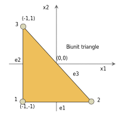
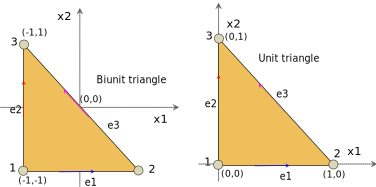
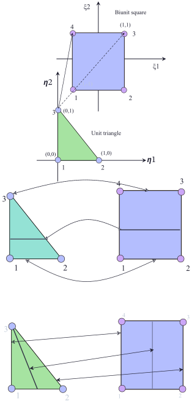

# Triangle

<!-- markdownlint-disable MD041 MD013 MD033 -->

There are two factors which play an important role in the quality of approximation for high degree polynomials: the smoothness of the function to be interpolated, and the locations of the interpolation points (Chen and Babuska 1995). Interpolation points completely determine the interpolation operator. Also, the norm of the interpolation operator provides a bound for the interpolation error by Lebesgue's inequality. In this way, the interpolation points play an important role in minimizing this error. For example, it is well known that the interpolation using equally spaced points yield undesirable divergent behaviors even for analytical functions as the polynomial degree of interpolation increases. To be more precise, the norm of the interpolation operator for equally spaced point set increases exponentially with the degree of polynomial interpolation. It has been reported in the spectral method community that the interpolation using Gauss quadrature of Chebyshev polynomials or using Lobatto quadrature of Legendre polynomial yields close to optimal interpolation properties in the uniform norm and in other norms. These results are also valid for rectangle in $R^{2}$ and hexahedron in $R^{3}.$ For triangles in $R^{2},$it is possible to obtain the near optimal interpolation set by minimizing appropriate measures related to the interpolation operator.

- The analysis of the quality of approximation of polynomial interpolation and the computation of the approximate optimal interpolation points in the triangle.
- Various norms for the interpolation operator.
- For a given polynomial degree, the set that minimizes the mean $L^{2}$ norm of the interpolation operator is close to the smallest Lebesgue constant interpolation set. In particular, for the triangle, this set gives the smallest Lebesgue constant currently known.

# Three-node triangle element


# Six-node triangle element


# Triangle with straight edges

# Isoparameteric triangle

# Master element

<!-- markdownlint-disable MD041 MD013 MD033 -->

## Biunit triangle

A Biunit triangle is given in figure below.



The coordinates of the biunit triangle are given by following table.

| node number | $x$ | $y$ |
| ----------- | --- | --- |
| 1           | -1  | -1  |
| 2           | 1   | -1  |
| 3           | -1  | 1   |

:::note
The biunit triangle serves as a master element for orthogonal basis and heirarchical basis on triangles.
:::

## Unit triangle


The coordinates of a unit triangle are given by following table.

| node number | $x$ | $y$ |
| ----------- | --- | --- |
| 1           | 0   | 0   |
| 2           | 1   | 0   |
| 3           | 0   | 1   |

:::note
The unit triangle serves as a master element for lagrange polynomials on triangles.
:::

## Master element for orthogonal and heirarchical polynomials

The master element for orthogonal polynomials and heirarchical polynomials is given by biunit triangle.

The orientation of edges is given by following table and figure.



| node number | n1 | n2 |
| ----------- | -- | -- |
| 1           | 1  | 2  |
| 2           | 2  | 3  |
| 3           | 1  | 3  |

- Edge 1 and edge 3 are oriented in the x and y direction respectively.

## Master element for Lagrange polynomials

The master element for Lagrange polynomial is usually given by unit triangle. The node numbering and coordinates are same as those discussed above. However, the orientation of the edges is slighly different. The orientation of edges is given by following table.

| node number | n1 | n2 |
| ----------- | -- | -- |
| 1           | 1  | 2  |
| 2           | 2  | 3  |
| 3           | 3  | 2  |

- Edge 1 is oriented in the x direction
- Edge 3 is oriented in the negative y direction

## Mapping from biunit tetrahedron to unit tetrahedron

Let us denote the coordinates in biunit tetrahedron by $(x_b, y_b, z_b)$ and unit tetrahedron by $(x_u, y_u, z_u)$.

Then the mapping from $(x_b, y_b, z_b) \mapsto (x_u, y_u, z_u)$ is given by,

$$
x_{u}=\frac{1}{2}\left(1+x_{b}\right)
$$

$$
y_{u}=\frac{1}{2}\left(1+y_{b}\right)
$$

$$
z_{u}=\frac{1}{2}\left(1+z_{b}\right)
$$

## Mapping from unit tetrahedron to biunit tetrahedron

The mapping from $(x_u, y_u, z_u) \mapsto (x_b, y_b, z_b)$ is given by,

$$
x_{b}=2x_{u}-1
$$

$$
y_{b}=2y_{u}-1
$$

$$
z_{b}=2z_{u}-1
$$

# High-order polynomial

## Linear basis function on triangle

$$
\phi_{i}^{(1)}\left(\xi,\eta\right)=a_{i}+b_{i}\xi+c_{i}\eta
$$

## Basis space

$$
\mathcal{P}_{\Delta}^{(1)}:=\left\{ 1,\xi,\eta\right\}
$$

## Pascal triangle

$$
\mathcal{P}_{\Delta}^{(m)}:=\begin{array}{ccccccccccccc}
& & & & & & 1\\
& & & & & \xi & & \eta\\
& & & & \xi^{2} & & \xi\eta & & \eta^{2}\\
& & & \xi^{3} & & \xi^{2}\eta & & \xi\eta^{2} & & \eta^{3}\\
& & \xi^{4} & & \xi^{3}\eta & & \xi^{2}\eta^{2} & & \xi\eta^{3} & & \eta^{4}\\
& & & & & \xi^{3}\eta^{2}\\
& \cdot & & & & & & & & & & \ddots\\
\xi^{m} & & \xi^{m-1}\eta & & \xi^{m-2}\eta^{2} & & \xi^{m-3}\eta^{3} & & \cdots & & \xi^{1}\eta^{m-1} & & \eta^{m}
\end{array}
$$

Following points should be noted.

- For a given order $m$, we have $m+1$ levels.
- At each level, $\xi^{i}\eta^{j}$, $i+j$ is constant, and equal to the level number. For example at level $l$ we have $i+j=l$
- At level $l$, we have $l+1$ degrees of freedom $\xi^{i}\eta^{l-i},\forall i=0,1,\cdots,l$

There are three useful ways to travel through Pascal's triangle.

### Along the first diagonal

```fortran
do j=0,m
  do i = 0, m-j
      xi^{i}*eta^{j}
  end do
end do
```

### Along the level/base

```fortran
do l=0,m
  do j=0,l
      xi^{l-j}*eta^{j}
  end do
end do
```

### Along the second diagonal

```fortran
do i=0,m
  do j = 0, m-i
      xi^{i}*eta^{j}
  end do
end do
```

## Some useful results

$$
\left(\xi+\eta\right)^{m}=\sum_{k=0}^{m}\left(\begin{array}{c}
m\\
k
\end{array}\right)\xi^{m-k}\eta^{k}
$$

$$
\partial_{x}^{m}\left(fg\right)=\sum_{k=0}^{m}\left(\begin{array}{c}
m\\
k
\end{array}\right)\left(\partial_{x}^{m-k}f\right)\left(\partial_{x}^{k}g\right)
$$

## High order polynomial expansion on triangle

### Left diagonal

$$
f(\xi,\eta)=\sum_{j=0}^{m}\sum_{i=0}^{m-j}a_{ij}\xi^{i}\eta^{j}
$$

### Right diagonal

$$
f(\xi,\eta)=\sum_{i=0}^{m}\sum_{j=0}^{m-i}a_{ij}\xi^{i}\eta^{j}
$$

### Along the base/level

$$
f(\xi,\eta)=\sum_{i=0}^{m}\sum_{j=0}^{i}a_{i-j,j}\xi^{i-j}\eta^{j}
$$

### Degrees of freedom

For $m$th order polynomial expansion there are

$$
N=\frac{1}{2}\left(m+1\right)\left(m+2\right)
$$

number of degrees of freedom.

So,

$$
f(\xi,\eta)=\sum_{n=1}^{N}a_{n}\phi_{n}\left(\xi,\eta\right)
$$

where, $\left\{ \phi_{n}\right\}_{n=1}^{N}$ are the basis functions.

### Lagrange polynomials

The above interpolation can be viewed as the interpolation in frequency space. The equivalent interpolation in the physical space is given through Cardinal functions (lagrange polynomials):

$$
f(\xi,\eta)=\sum_{j=1}^{N}f_{j}l_{j}^{(m)}\left(\xi,\eta\right)
$$

where, $l_{j}^{(m)}\left(\xi,\eta\right)$ is the mth order cardinal function (lagrange polynomial) at point $j$, satisfying

$$
l_{j}^{(m)}(\xi_{i},\eta_{i})=\delta_{ij}
$$

and $f_{i}$ is $f(\xi_{i},\eta_{i})$. We obtain $l_{j}^{(m)}$ as follows:

$$
l_{j}^{(m)}\left(\xi,\eta\right)=\sum_{n=1}^{N}c_{n}\phi_{n}\left(\xi,\eta\right)
$$

using the cardinality condition, we get

$$
\mathbf{V}_{\phi}\mathbf{c}_{j}=\mathbf{e}_{j}
$$

where, $V$ is the Vandermonde matrix:

$$
\mathbf{V}_{\phi}=\left[\begin{array}{cccc}
\phi_{1}\left(\xi_{1},\eta_{1}\right) & \phi_{2}\left(\xi_{1},\eta_{1}\right) & \cdots & \phi_{N}\left(\xi_{1},\eta_{1}\right)\\
\phi_{1}\left(\xi_{2},\eta_{2}\right) & \phi_{2}\left(\xi_{2},\eta_{2}\right) & \cdots & \phi_{N}\left(\xi_{2},\eta_{2}\right)\\
\vdots & \vdots & \ddots & \vdots\\
\phi_{1}\left(\xi_{N},\eta_{N}\right) & \phi_{2}\left(\xi_{N},\eta_{N}\right) & & \phi_{N}\left(\xi_{N},\eta_{N}\right)
\end{array}\right]
$$

Then the lagrange polynomial is given by

$$
l_{j}^{(m)}\left(\xi,\eta\right)=\boldsymbol{\phi}^{T}\left\{ \mathbf{\mathbf{V}_{\phi}}^{-1}\mathbf{e}_{j}\right\}
$$

or

$$
\mathbf{l}^{(m)}\left(\xi,\eta\right)=\mathbf{\mathbf{V}_{\phi}}^{-T}\boldsymbol{\phi}
$$

or

$$
\mathbf{\mathbf{V}_{\phi}}^{T}\mathbf{l}^{(m)}\left(\xi,\eta\right)=\boldsymbol{\phi}\left(\xi,\eta\right)
$$

In this way, Vandermonde matrix facilitates the transformation from frequency domain to physical domain.

## Remarks

- For higher order polynomials, the solution of the linear system for the nodal interpolation functions can be found by numerical methods. Unlike 1D interpolation problem, existence, and uniqueness of the solution of $\mathbf{V}_{\phi}\mathbf{c}_{j}=\mathbf{e}_{j}$ are not guaranteed and one should be careful in selecting the interpolation points and basis functions. Moreover, the condition number of the generalized Vandermonde matrix is sensitive to the choice of the base functions. The large condition number can lead to the difficulty of solving the linear system. Therefore, in practice, it is advantageous to use a set of polynomial basis functions that enjoy orthogonal or near-orthogonality properties, for example, **Appell** and **Proriol** polynomials.

- The location of nodal points in physical space is also critical for enhancing the interpolation in physical space.

# Lebesque constant


# Uniform Grid over triangles

<!-- markdownlint-disable MD041 MD013 MD033 -->

Unfortunately, as the expansion order $m$ is increased, the accuracy over the uniform grid deteriorates due to the Runge effect. In particular, the interpolated function experiences large oscillations between nodes and the Lebesgue constant increases rapidly with N (Bos, 1983). Thus, the uniform node distribution is only suitable for low-order polynomial expansions, typically $m\le3$. To improve the interpolation accuracy, Bos (1983) cleverly modified the uniform node layout by expanding or contracting the individual sizes of the nested triangles while maintaining the uniformity of the point distribution around their perimeters


# Lobatto grid

<!-- markdownlint-disable MD041 MD013 MD033 -->

A node distribution corresponding to the zeros of Lobatto polynomials is optimal for 1D interpolation, subject to the constraint that one node is placed at the left-end and another node is placed at the right- end of the interpolation domain.

To construct $m$ th order grid, we need

$$
\frac{1}{2}\left(m+1\right)\left(m+2\right)
$$
nodes. At each edge we have $m-1$ internal nodes. These $m-1$ internal nodes are zeros Lobatto polynomial of order $m-1$, which is given by

$$
L_{m-1}(x)=\partial_{x}P_{m}(x)
$$

Let $\left\{ t_{i}\right\}_{i=2}^{m}$ be the zeros of $L_{m-1}$ in $[-1,1]$, and $t_{0}=-1$ and $t_{m+1}=1$. Now we transform these nodes to $[0,1]$ domain by

$$
v_{i}=\frac{1}{2}\left(1+t_{i}\right),i=1,2\cdots,m+1
$$

Note that $v_{i}\in\left[0,1\right],\forall i$.

The location of nodes along the hypotenuse of the triangle is found by moving either vertically upward from the nodes on the $\xi$ axis, or horizontally to the right from the nodes on the $\eta$ axis.

## Horizontal-Vertical distribution (HV)

For $i=1,2,\cdots,m+1$, and $j=1,2,\cdots,m+2-i$, the location of internal nodes is given by

$$
\xi_{i}=v_{i}
$$

$$
\eta_{j}=1-v_{m+2-j}
$$

- Horizontal-Diagonal

- Vertical-Diagonal

The asymmetry of the distribution with respect to the three vertices is an unacceptable deficiency.

## Blyth and Pozrikidis grid

Threefold rotational symmetry.

For $i=1,2,\cdots,m+1$, For $j=1,2,\cdots,m+2-i$ and $k=m+3-i-j$:

$$
\xi_{i}=\frac{1}{3}\left(1+2v_{j}-v_{i}-v_{k}\right)
$$

$$
\eta_{j}=\frac{1}{3}\left(1+2v_{j}-v_{i}-v_{k}\right)
$$

- Recursive grid

# Feket nodes

<!-- markdownlint-disable MD041 MD013 MD033 -->

Another way of arranging the interpolation nodes over the triangle is provided by the Fekete points. To define these points, we apply the polynomial expansion nodes over the surface of the triangle, and consider the generalized Vandermonde matrix, regarded as a function of the nodal positions.

By definition, the Fekete points maximize the magnitude of the determinant of the generalized Vandermonde matrix within the confines of the triangle. The significance of the Fekete points lies in the observation that the cardinal interpolation functions may be expressed in the form:

the vertex and edge nodes turn out to be located precisely at the zeros of the Lobatto polynomial.

This means that the Lebesgue constant defined is bounded from above by N . In fact, numerical evidence suggests that the upper bound is proportional to $\sqrt{N}$ (Taylor et al., 2000). At present, the Lebesgue constant for the Fekete points is the lowest known constant for $m>10$ (Taylor et al., 2000).

# Chen and Babuska nodes

<!-- markdownlint-disable MD041 MD013 MD033 -->

Unlike the Fekete set, this distribution does not include edge nodes corresponding to zeros of the Lobatto polynomials.

# Hesthaven nodes

<!-- markdownlint-disable MD041 MD013 MD033 -->

Hesthaven (1998) obtained small Lebesgue constants by minimizing an electrostatic energy function. Like the Fekete set, these distributions include edge nodes corresponding to the zeros of the Lobatto polynomials.


# Appell polynomials

<!-- markdownlint-disable MD041 MD013 MD033 -->

In the previous example we employed $\phi_{n}(\xi,\eta)$ of the form $\xi^{i}\eta^{j}$. In this section we use Appell polynomials.

Appell polynomial $A=A_{kl}$ satisfy the following partial differential equation:

$$
\begin{aligned}\xi\left(\xi-1\right)A_{\xi\xi}+2\xi\eta A_{\xi\eta} & +\eta\left(\eta-1\right)A_{\eta\eta}\\
+\left(3\xi-1\right)A_{\xi}+\left(3\eta-1\right)A_{\eta} & =\left(k+l\right)\left(k+l+2\right)A
\end{aligned}
$$

## Left diagonal

$$
f(\xi,\eta)=\sum_{q=0}^{m}\sum_{p=0}^{m-q}\hat{a}_{pq}A_{pq}(\xi,\eta)
$$

## Right diagonal

$$
f(\xi,\eta)=\sum_{p=0}^{m}\sum_{q=0}^{m-q}\hat{a}_{pq}A_{pq}(\xi,\eta)
$$

## Along the base/level

$$
f(\xi,\eta)=\sum_{p=0}^{m}\sum_{q=0}^{p}\hat{a}_{p-q,q}A_{p-q,q}(\xi,\eta)
$$

## Properties

Properties of $A_{kl}(\xi,\eta)$ polynomials

- $A_{kl}$ has order $k+l$, that is

$$
A_{kl}=\sum_{i=0}^{k+l}\left(\sum_{j=0}^{k+l-i}a_{kl}^{ij}\xi^{i}\eta^{j}\right)
$$

where,

$$
a_{kl}^{ij}=\left(-1\right)^{i+j}\frac{\left(k+j\right)!\left(l+i\right)!}{\left(i!j!\right)^{2}}\frac{\left(k+l\right)!}{\left(k+l-i-j\right)!}
$$

also,

$$
a_{kl}^{ij}=a_{lk}^{ji}
$$

- Rodrigues fomula:

$$
A_{kl}=\frac{\partial^{k+l}}{\partial\xi^{k}\partial\eta^{l}}\left(\xi^{k}\eta^{l}\zeta^{k+l}\right)
$$

where, $\zeta=1-\xi-\eta$.

- $A_{kl}\in\mathcal{P}_{\Delta}^{(k+l)}$ , for $m$th order interpolation we have following $A_{kl}$

$$
A_{kl}:=\begin{array}{ccccccccccccc}
& & & & & & A_{0,0}\\
& & & & & A_{1,0} & & A_{0,1}\\
& & & & A_{2,0} & & A_{1,1} & & A_{0,2}\\
& & & A_{3,0} & & A_{2,1} & & A_{1,2} & & A_{0,3}\\
& & A_{4,0} & & A_{3,1} & & A_{2,2} & & A_{1,3} & & A_{0,4}\\
& . & & & & & & & & & \ddots\\
A_{m,0} & & A_{m-1,1} & & A_{m-2,2} & & A_{m-3,3} & & \cdots & & A_{1,m-1} & & A_{0,m}
\end{array}
$$

Incomplete biorthogonality

$$
\int\int A_{kl}\left(\xi,\eta\right)\xi^{p}\eta^{q}d\xi d\eta=0
$$

for $p+q<k+l$. Consequently,

$$
\int\int A_{kl}\left(\xi,\eta\right)d\xi d\eta=0
$$

for $k,l>0$.

Incomplete orthogonality

$$
\int\int A_{kl}A_{pq}d\xi d\eta=0
$$

for $k+l\ne p+q$

# Triangle-Square mapping (part1)



Let $(\eta_{1},\eta_{2})$ be the coordinates in the reference unit triangle $\mathcal{T}$,

$$
\mathcal{T}:=\left\{ \left(\eta_{1},\eta_{2}\right)\in\mathbb{R}^{2}:0<\eta_{1},\eta_{2};\eta_{1}+\eta_{2}<1\right\},
$$

and $(\xi_{1},\xi_{2})$ be the coordinates in reference biunit square $\mathcal{Q}$.

$$
\mathcal{Q}:=\left\{ \left(\xi_{1},\xi_{2}\right)\in\mathbb{R}^{2}:-1<\xi_{1},\xi_{2}<1\right\}
$$

The mapping from (unit) triangle to (biunit) square,

$$
\left(\eta_{1},\eta_{2}\right)\mapsto \left(\xi_{1},\xi_{2}\right)
$$

is given by:

$$
\begin{aligned}\xi_{1} & =\frac{2 \eta_{1}}{1-\eta_{2}}-1\\
& =\frac{2 \eta_{1}+ \eta_{2}-1}{1-\eta_{2}}
\end{aligned}
$$

$$
\xi_{2}=2 \eta_{2}-1
$$

:::note

$$
\lim_{\eta_{2}\rightarrow1}\xi_{1}=-1
$$

:::

A horizontal line in square, that is $\xi_{2}=\eta_{0}$, maps to a horizontal line in the triangle:

$$
\eta_{2}=\frac{\eta_{0}+1}{2};0\le \eta_{1}\le1-\eta_{2}
$$

Similarly, a vertical line in square, that is,

$$
\xi_{1}=\xi_{0},
$$

maps to a line passing through vertex-3 $(0,1)$, and intersecting the base which connects vertex-1 and vertex-2. The equation of this line is given below, where it can be seen that the vertical edge of triangle (vertex 1-3) corresponds to the left edge of square, i.e., $\xi_{0}=-1$, and hypotenuse of triangle (vertex 2-3) corresponds to the right edge of square, i.e., $\xi_{0}=1$. The line intersects the base of triangle at $\eta_{1}=\frac{1+\xi_{0}}{2}$.

$$
\eta_{2}=-\frac{2}{1+\xi_{0}}\eta_{1}+1
$$

Jacobian of the mapping is given below:

$$
\frac{\partial\xi_{1}}{\partial \eta_{1}}=\frac{2}{1-\eta_{2}}
$$

$$
\frac{\partial\xi_{1}}{\partial \eta_{2}}=\frac{2 \eta_{1}}{\left(1-\eta_{2}\right)^{2}}
$$

$$
\frac{\partial\xi_{2}}{\partial \eta_{1}}=0
$$

$$
\frac{\partial\xi_{2}}{\partial \eta_{2}}=2
$$

The inverse of mapping, that is from biunit square to unit triangle, $\left(\xi_{1},\xi_{2}\right) \mapsto \left(\eta_{1}, \eta_{2}\right)$ is given below:

$$
\eta_{1}=\frac{1}{4}\left(1+\xi_{1}\right)\left(1-\xi_{2}\right)
$$

$$
\eta_{2}=\frac{\xi_{2}+1}{2}
$$

$$
\frac{\partial \eta_{1}}{\partial\xi_{1}}=\frac{1}{4}\left(1-\xi_{2}\right)
$$

$$
\frac{\partial \eta_{1}}{\partial\xi_{2}}=-\frac{1}{4}\left(1+\xi_{1}\right)
$$

$$
\frac{\partial \eta_{1}}{\partial\xi_{2}}=0
$$

$$
\frac{\partial \eta_{2}}{\partial\xi_{2}}=\frac{1}{2}
$$

:::info
The coordinates $(\xi_{1}, \xi_{2})$ are called the **collapsed Cartesian coordinates** of the point on the triangle whose regular Cartestian coordinates are $(\eta_{1}, \eta_{2})$.
:::

# Triangle square mapping (part2)

<!-- markdownlint-disable MD041 MD013 MD033 MD012 -->

The biunit triangle is defined by

$$
\mathcal{T}:=\left\{ \left(\eta_{1},\eta_{2}\right)\in\mathbb{R}^{2}\vert-1<\eta_{1},\eta_{2};\eta_{1}+\eta_{2}<0\right\}
$$

The mapping from (biunit) triangle to (biunit) square, $\left(\eta_{1},\eta_{2}\right)\rightarrow\left(\xi_{1},\xi_{2}\right)$ is given by:

$$
\begin{aligned}\xi_{1} & =2\left(\frac{1+\eta_{1}}{1-\eta_{2}}\right)-1\\
& =\frac{2+2 \eta_{1}-1+ \eta_{2}}{1- \eta_{2}}\\
& =\frac{1+2 \eta_{1}+ \eta_{2}}{1- \eta_{2}}
\end{aligned}
$$

$$
\lim_{\eta_{2}\rightarrow1}=-1
$$

$$
\xi_{2}=\eta_{2}
$$

Jacobian of the mapping is given by:

$$
\frac{\partial\xi_{1}}{\partial \eta_{1}}=\frac{2}{1- \eta_{2}}
$$

$$
\frac{\partial\xi_{1}}{\partial \eta_{2}}=2\frac{1+ \eta_{1}}{\left(1-\eta_{2}\right)^{2}}
$$

$$
\frac{\partial\xi_{2}}{\partial \eta_{1}}=0
$$

$$
\frac{\partial\xi_{2}}{\partial \eta_{2}}=1
$$

The mapping from square to triangle, $\left(\xi_{1},\xi_{2}\right)\rightarrow\left(\eta_{1},\eta_{2}\right)$

$$
\eta_{1}=\frac{1}{2}\left(1+\xi_{1}\right)\left(1-\xi_{2}\right)-1
$$

$$
\eta_{2}=\xi_{2}
$$

The Jacobian of inverse of mapping is given by:

$$
\frac{\partial \eta_{1}}{\partial\xi_{1}}=\frac{1}{2}\left(1-\xi_{2}\right)
$$

$$
\frac{\partial \eta_{1}}{\partial\xi_{2}}=-\frac{1}{2}\left(1+\xi_{1}\right)
$$

$$
\frac{\partial \eta_{2}}{\partial\xi_{1}}=0
$$

$$
\frac{\partial \eta_{2}}{\partial\xi_{2}}=1
$$

# Orthogonal basis on biunit square

<!-- markdownlint-disable MD041 MD013 MD033 MD012 -->

Simplex domains such as triangle, tetrahedron, prisms, and pyramids are very efficient in handling the complex geometries. However, spectral methods are more efficient on tensor-product domains due to tensor product expansion of basis functions. Therefore, it would be beneficial to introduce the tensor product expansion of basis function on simplex domain such as biunit triangle.

In 1991, Dubiner presented the concept of warped tensor-product expansion on triangles. Let the biunit triangle is defined by $\mathcal{T}$:

$$
\mathcal{T}:=\left\{ \left(\eta_{1},\eta_{2}\right)\in\mathbb{R}^{2}\vert-1<\eta_{1},\eta_{2};\eta_{1}+\eta_{2}<0\right\}
$$

Let $P_{n}^{\left(\alpha,\beta\right)}\left(x\right)$ be the Jacobi polynomial of order $n\le N$, which are orthogonal with respect to the weight $\left(1-x\right)^{\alpha}\left(1+x\right)^{\beta}$. Let ${\bf k}=\left(k_{1},k_{2}\right),$ then we define the following warped tensor product on $\mathcal{Q}$.

$$
\Phi_{{\bf k}}\left(\xi_{1},\xi_{2}\right)=\psi_{k_{1}}\left(\xi_{1}\right)\psi_{k_{1},k_{2}}\left(\xi_{2}\right),
$$

where,

$$
\psi_{k_{1}}\left(\xi_{1}\right)=P_{k_{1}}^{\left(0,0\right)}\left(\xi_{1}\right)
$$

is the Legendre polynomial, and

$$
\psi_{k_{1},k_{2}}\left(\xi_{2}\right)=\left(\frac{1-\xi_{2}}{2}\right)^{k_{1}}P_{k_{2}}^{\left(2k_{1}+1,0\right)}\left(\xi_{2}\right),
$$

which is a polynomial of degree $k_1 + k_2$ in $\xi_{2}$.

Therefore,

$$
\Phi_{{\bf k}}\left(\xi_{1},\xi_{2}\right)=P_{k_{1}}^{\left(0,0\right)}\left(\xi_{1}\right)\left(\frac{1-\xi_{2}}{2}\right)^{k_{1}}P_{k_{2}}^{\left(2k_{1}+1,0\right)}\left(\xi_{2}\right)
$$

:::note
$\xi_{1}$ and $\xi_{2}$ belongs to the bi-unit segments.
:::

:::note
$\Phi_{{\bf k}}\left(\xi_{1},\xi_{2}\right)$ is $k_{1}$ order in $\xi_{1}$ and $k_{1}+k_{2}$ order in $\xi_{2}$ direction, as $\psi_{k_{1}}$ is $k_{1}$ order in $\xi_{1}$ and $\psi_{k_{1},k_{2}}$ is $k_{1}+k_{2}$ order in $\xi_{2}$ direction.
:::

:::info
Dimension of the polynomial space

$$
\frac{1}{2}\left(N+1\right)\left(N+2\right)
$$

where, $N$ is the order of approximation on triangle.
:::

## Partial Orthogonality

By using the orthogonality of the Jacobi polynomials, we can show that, for $\mathbf{k} \ne \mathbf{h}$,

$$
\int_{\mathcal{T}} \phi_{\mathbf{k}}(x_1, x_2) \phi_{\mathbf{h}}(x_1, x_2)dx_1 dx_2=0
$$

In this way, we can conclude that the set

$$
\mathbb{P}_{N}:=\left\{ \phi_{k1,k2}\left(x_{1},x_{2}\right):0\le k_{1},k_{2};k_{1}+k_{2}\le N\right\}
$$

forms the orthogonal modal basis of the space:

$$
\mathcal{P}_{N}=\left\{ x_{1}^{i}x_{2}^{j}:0\le i,j;i+j\le N\right\}
$$

## Gradient of orthogonal polynomial

$$
\frac{\partial \Phi_{{\bf k}}\left(\xi_{1},\xi_{2}\right)}{\partial \xi_{1}}{}= \frac{d P_{k_{1}}^{\left(0,0\right)}\left(\xi_{1}\right)}{d\xi_{1}} \left(\frac{1-\xi_{2}}{2}\right)^{k_{1}}P_{k_{2}}^{\left(2k_{1}+1,0\right)}\left(\xi_{2}\right)
$$

$$
\begin{aligned}\frac{\partial\Phi_{{\bf k}}\left(\xi_{1},\xi_{2}\right)}{\partial\xi_{2}} & =P_{k_{1}}^{\left(0,0\right)}\left(\xi_{1}\right)\left(\frac{1-\xi_{2}}{2}\right)^{k_{1}}\frac{d}{d\xi_{2}}P_{k_{2}}^{\left(2k_{1}+1,0\right)}\left(\xi_{2}\right)\\ & -\frac{k_{1}}{2}P_{k_{1}}^{\left(0,0\right)}\left(\xi_{1}\right)P_{k_{2}}^{\left(2k_{1}+1,0\right)}\left(\xi_{2}\right)\left(\frac{1-\xi_{2}}{2}\right)^{k_{1}-1}\\ & =P_{k_{1}}^{\left(0,0\right)}\left(\xi_{1}\right)\left(\frac{1-\xi_{2}}{2}\right)^{k_{1}-1}\left[\left(\frac{1-\xi_{2}}{2}\right)\frac{d}{d\xi_{2}}P_{k_{2}}^{\left(2k_{1}+1,0\right)}\left(\xi_{2}\right)-\frac{k_{1}}{2}P_{k_{2}}^{\left(2k_{1}+1,0\right)}\left(\xi_{2}\right)\right] \end{aligned}
$$

# Orthogonal basis on unit triangle

<!-- markdownlint-disable MD041 MD013 MD033 MD012 -->

The unit triangle is given by $\mathcal{T}$,

$$
\mathcal{T}:=\left\{ \left(\eta_{1},\eta_{2}\right)\in\mathbb{R}^{2}:0<\eta_{1},\eta_{2};\eta_{1}+\eta_{2}<1\right\},
$$

To calculate the Orthogonal basis (Dubiner) on the unit triangle, we use the mapping from a unit triangle to a biunit square $(\xi_1, \xi_2)$:

$$
\xi_{1}=\frac{2 \eta_{1}}{1- \eta_{2}}-1
$$

$$
\xi_{2}=2 \eta_{2}-1
$$

Then,

$$
\begin{aligned}\phi_{{\bf k}}\left(\eta_{1},\eta_{2}\right) & =\Phi_{{\bf k}}\left(\xi_{1},\xi_{2}\right)\\
& =P_{k_{1}}^{\left(0,0\right)}\left[\xi_{1}\left(\eta_{1},\eta_{2}\right)\right]\left(1-\eta_{2}\right)^{k_{1}}P_{k_{2}}^{\left(2k_{1}+1,0\right)}\left[\xi_{2}\left(\eta_{1}, \eta_{2}\right)\right]
\end{aligned}
$$

## Gradient of orthogonal polynomials

The Jacobian of mapping from $(\xi_{1}, \xi_{2}) \mapsto (\eta_{1}, \eta_{2})$ is given by

$$
\frac{\partial\xi_{i}}{\partial\eta_{j}}=\left[\begin{array}{cc} \frac{2}{1-\eta_{2}} & \frac{2\eta_{1}}{\left(1-\eta_{2}\right)^{2}}\\ 0 & 2 \end{array}\right]
$$
Then, the gradient of orthogonal polynomials in triangular domain is given by:

$$
\begin{aligned}\frac{\partial\Phi_{{\bf k}}}{\partial\eta_{1}} & =\frac{\partial\Phi_{{\bf k}}}{\partial\xi_{1}}\frac{\partial\xi_{1}}{\partial\eta_{1}}+\frac{\partial\Phi_{{\bf k}}}{\partial\xi_{2}}\frac{\partial\xi_{2}}{\partial\eta_{1}}\\ & =\frac{\partial\Phi_{{\bf k}}}{\partial\xi_{1}}\frac{2}{1-\eta_{2}} \end{aligned}
$$

$$
\begin{aligned}\frac{\partial\Phi_{{\bf k}}}{\partial\eta_{1}} & =\frac{\partial\Phi_{{\bf k}}}{\partial\xi_{1}}\frac{\partial\xi_{1}}{\partial\eta_{1}}+\frac{\partial\Phi_{{\bf k}}}{\partial\xi_{2}}\frac{\partial\xi_{2}}{\partial\eta_{1}}\\ & =\frac{\partial\Phi_{{\bf k}}}{\partial\xi_{1}}\frac{2}{1-\eta_{2}}\\ & =\frac{\partial\Phi_{{\bf k}}}{\partial\xi_{1}}\frac{4}{1-\xi_{2}} \end{aligned}
$$

$$
\begin{aligned}\frac{\partial\Phi_{{\bf k}}}{\partial\eta_{2}} & =\frac{\partial\Phi_{{\bf k}}}{\partial\xi_{1}}\frac{\partial\xi_{1}}{\partial\eta_{2}}+\frac{\partial\Phi_{{\bf k}}}{\partial\xi_{2}}\frac{\partial\xi_{2}}{\partial\eta_{2}}\\ & =\frac{\partial\Phi_{{\bf k}}}{\partial\xi_{1}}\frac{2\eta_{1}}{\left(1-\eta_{2}\right)^{2}}+2\frac{\partial\Phi_{{\bf k}}}{\partial\xi_{2}}\\ & =\frac{\partial\Phi_{{\bf k}}}{\partial\eta_{1}}\frac{\eta_{1}}{\left(1-\eta_{2}\right)}+2\frac{\partial\Phi_{{\bf k}}}{\partial\xi_{2}}\\ & =\frac{\partial\Phi_{{\bf k}}}{\partial\eta_{1}}\frac{1+\xi_{1}}{2}+2\frac{\partial\Phi_{{\bf k}}}{\partial\xi_{2}} \end{aligned}
$$

# Dubiner basis on biunit triangle

<!-- markdownlint-disable MD041 MD013 MD033 MD012 -->

To calculate the Dubiner basis on the biunit triangle, we use the following mapping from biunit triangle to biunit square:

$$
\xi_{1}=2\left(\frac{1+x_{1}}{1-x_{2}}\right)-1
$$

$$
\xi_{2}=x_{2}
$$

Then,

$$
\begin{aligned}\phi_{{\bf k}}\left(x_{1},x_{2}\right) & =\Phi_{{\bf k}}\left(\xi_{1},\xi_{2}\right)\\
& =P_{k_{1}}^{\left(0,0\right)}\left[\xi_{1}\left(x_{1},x_{2}\right)\right]\left(\frac{1-x_{2}}{2}\right)^{k_{1}}P_{k_{2}}^{\left(2k_{1}+1,0\right)}\left(x_{2}\right)
\end{aligned}
$$

# Hierarchical basis

<!-- markdownlint-disable MD041 MD013 MD033 MD012 -->

The use of orthogonal basis simplifies the structure of mass matrix. However, it complicates the enforcement of boundary conditions, or of matching conditions between two subdomains. To overcome these issues, we classified basis function in a heirarchical order. In other words, we define basis functions for node, edge, and cell.

For example, for $m$th order isotropic approximation on a triangle, we have a total

$$
\left(m+1\right)\left(m+2\right)/2
$$

modes with following partition:

- 3 vertex mode
- $3\left(m-1\right)$ edge bubble modes
- $\left(m-1\right)\left(m-2\right)/2$ cell bubble modes

:::note

- For edge bubble modes to exist $m \ge 2$.
- For cell bubble modes to exist $m \ge 3$.

:::

## Barycentric coordinates

### Biunit triangle

Let ${\eta}_{1}, {\eta}_{2}$ be the coordinates of a biunit triangle, then the barycentric coordinates are given by

$$
\lambda_{1,t}\left({\eta}_{1},{\eta}_{2}\right)=-\frac{1}{2}\left({\eta}_{1}+{\eta}_{2}\right)
$$

$$
\lambda_{2,t}\left({\eta}_{1},{\eta}_{2}\right)=\frac{1}{2}\left(1+{\eta}_{1}\right)
$$

$$
\lambda_{3,t}\left({\eta}_{1},{\eta}_{2}\right)=\frac{1}{2}\left(1+{\eta}_{2}\right)
$$

The Jacobian of mapping is given by:

$$
\frac{\partial\lambda}{\partial\eta}=\left[\begin{array}{cc} -\frac{1}{2} & -\frac{1}{2}\\ \frac{1}{2} & 0\\ 0 & \frac{1}{2} \end{array}\right]
$$

Example: Let's consider an edge (2-1). On this edge $\lambda_{3}=0$. Therefore, we have $\eta_{2} = -1$. Therefore,

$$
2*\lambda_{1} = 1 - \eta_{1}
$$

$$
2*\lambda_{2} = 1.0 + \eta_{1}
$$

Therefore,

$$
\lambda_{2} - \lambda_{1} = \eta_{1}
$$

Therefore, on edge (2-1), we have following relation:

$$
\eta_{1} = \lambda_{2} - \lambda_{1}
$$

Similarly, on edge (1-3) we have

$$
\eta_{2} = \lambda_{3} - \lambda_{1}
$$

where $\eta_{1,2} \in [-1, 1]$

### Unit triangle

For unit triangle, barycentric coordinates are given by

$$
\lambda_{1,t}\left({\eta}_{1},{\eta}_{2}\right)=1-{\eta}_{1}-{\eta}_{2}
$$

$$
\lambda_{2,t}\left({\eta}_{1},{\eta}_{2}\right)={\eta}_{1}
$$

$$
\lambda_{3,t}\left({\eta}_{1},{\eta}_{2}\right)={\eta}_{2}
$$

The Jacobian of mapping is given by

$$
\frac{\partial\lambda}{\partial\eta}=\left[\begin{array}{cc} -1 & -1\\ 1 & 0\\ 0 & 1 \end{array}\right]
$$

Let $\phi_{n}(x)$ for $x\in[-1,1]$ be the Kernel polynomial corresponding to the Lobatto polynomials.

$$
\phi_{m}(x)=-\frac{\sqrt{8\left(2m+3\right)}}{\left(m+1\right)\left(m+2\right)}P_{m}^{(1.5)}\left(x\right),\quad m\ge0
$$

or

$$
\phi_{m}(x)=-\frac{\sqrt{2\left(2m+3\right)}}{m+1}P_{m}^{\left(1,1\right)}(x),\quad m\ge0
$$

## Vertex basis functions Barycentric

$$
\phi_{1}^{v}\left({\eta}_{1}, {\eta}_{2}\right)=\lambda_{1}
$$

$$
\phi_{2}^{v}\left({\eta}_{1},{\eta}_{2}\right)=\lambda_{2}
$$

$$
\phi_{3}^{v}\left({\eta}_{1}, {\eta}_{2}\right)=\lambda_{3}
$$

The gradient of **Vertex** basis functions is given by:

## Edge basis functions Barycentric

$$
\phi_{k}^{e_{1}}=\lambda_{1}\lambda_{2}\phi_{k-2}\left(\lambda_{2}-\lambda_{1}\right),\quad k=2,3,\cdots,p^{e_{1}}
$$

$$
\phi_{k}^{e_{2}}=\lambda_{1}\lambda_{3}\phi_{k-2}\left(\lambda_{3}-\lambda_{1}\right),\quad k=2,3,\cdots,p^{e_{2}}
$$

$$
\phi_{k}^{e_{3}}=\lambda_{2}\lambda_{3}\phi_{k-2}\left(\lambda_{3}-\lambda_{2}\right),\quad k=2,3,\cdots,p^{e_{3}}
$$

## Cell basis functions Barycentric

$$
\phi_{k_{1},k_{2}}^{b}=\lambda_{1}\lambda_{2}\lambda_{3}\phi_{k_{1}-1}\left(\lambda_{2}-\lambda_{1}\right)\phi_{k_{2}-1}\left(\lambda_{3}-\lambda_{1}\right),\quad1\le k_{1},k_{2};k_{1}+k_{2}\le p^{b}-1
$$

## Biunit square coordinates

:::note
In the above section, we have computed the basis function in terms of Barycentric coordinates. In this section, we will compute the basis function on the bi-unit square which is mapped to the triangle via Duffy mapping. This procedure is described in the Karniadakis's textbook, chapter 3.2.3.1.

- We will denote the coordinates of biunit triangle by $\xi_{i}$
- Coordinates of biunit square by $\eta_{i}$

:::

Let us define the following functions:

$$
l_{0}(y) = \frac{1}{2}(1-y)
$$

$$
l_{1}(y) = \frac{1}{2}(1+y)
$$

## Vertex basis functions Biunit

The vertex basis functions are given by:

$$
\phi_{1}^{v}\left({\xi}_{1}, {\xi}_{2}\right)=l_{0}\left(\eta_{1}\right)l_{0}\left(\eta_{2}\right)
$$

$$
\phi_{2}^{v}\left({\xi}_{1},{\xi}_{2}\right)=l_{1}\left(\eta_{1}\right)l_{0}\left(\eta_{2}\right)
$$

$$
\phi_{3}^{v}\left({\xi}_{1},{\xi}_{2}\right)=l_{1}\left(\eta_{1}\right)l_{1}\left(\eta_{2}\right)+l_{0}\left(\eta_{1}\right)l_{1}\left(\eta_{2}\right)
$$

The gradient of vertex basis functions are given by

$$
\nabla_{\eta}\phi_{1}^{v}\left(\xi_{1},\xi_{2}\right)=\left[\begin{array}{c}
\frac{dl_{0}\left(\eta_{1}\right)}{d\eta_{1}}l_{0}\left(\eta_{2}\right)\\
l_{0}\left(\eta_{1}\right)\frac{d}{d\eta_{2}}l_{0}\left(\eta_{2}\right)
\end{array}\right]
$$

$$
\nabla_{\eta}\phi_{2}^{v}\left({\xi}_{1},{\xi}_{2}\right) =\left[\begin{array}{c} \frac{dl_{1}\left(\eta_{1}\right)}{d\eta_{1}}l_{0}\left(\eta_{2}\right)\\ l_{1}\left(\eta_{1}\right)\frac{d}{d\eta_{2}}l_{0}\left(\eta_{2}\right) \end{array}\right]
$$

$$
\nabla_{\eta}\phi_{3}^{v}\left({\xi}_{1},{\xi}_{2}\right) =\left[\begin{array}{c} \frac{d}{d\eta_{1}}l_{1}\left(\eta_{1}\right)l_{1}\left(\eta_{2}\right)+\frac{d}{d\eta_{1}}l_{0}\left(\eta_{1}\right)l_{1}\left(\eta_{2}\right)\\ l_{1}\left(\eta_{1}\right)\frac{d}{d\eta_{2}}l_{1}\left(\eta_{2}\right)+l_{0}\left(\eta_{1}\right)\frac{d}{d\eta_{2}}l_{1}\left(\eta_{2}\right) \end{array}\right]
$$

## Edge basis functions Biunit

$$
\phi_{k_{1}}^{e_{1}}\left(\xi_{1},\xi_{2}\right)= l_{0}\left(\eta_{1}\right)l_{1}\left(\eta_{1}\right)P_{k_{1}-2}^{\left(1,1\right)}\left(\eta_{1}\right)\left[l_{0}\left(\eta_{2}\right)\right]^{k_{1}},k_{1}=2,3,\cdots,p^{e_{1}}
$$

$$
\phi_{k_{2}}^{e_{2}}\left(\xi_{1},\xi_{2}\right)= l_{0}\left(\eta_{1}\right)l_{0}\left(\eta_{2}\right)l_{1}\left(\eta_{2}\right)P_{k_{2}-2}^{\left(1,1\right)}\left(\eta_{2}\right),k_{2}=2,3,\cdots,p^{e_{2}}
$$

$$
\phi_{k_{2}}^{e_{3}}\left(\xi_{1},\xi_{2}\right)= l_{1}\left(\eta_{1}\right)l_{0}\left(\eta_{2}\right)l_{1}\left(\eta_{2}\right)P_{k_{2}-2}^{\left(1,1\right)}\left(\eta_{2}\right),k_{2}=2,3,\cdots,p^{e_{3}}
$$

## Cell basis functions Biunit

$$
\phi_{k_{1},k_{2},t}^{b}\left(\xi_{1},\xi_{2}\right)= l_{0}\left(\eta_{1}\right)l_{1}\left(\eta_{1}\right)P_{k_{1}-2}^{\left(1,1\right)}\left(\eta_{1}\right)\left[l_{0}\left(\eta_{2}\right)\right]^{k_{1}}l_{1}\left(\eta_{2}\right)P_{k_{2}-2}^{\left(2k_{1}-1,1\right)}\left(\eta_{2}\right),k_{1},k_{2}\ge2,k_{1}+k_{2}\le m+1
$$

# Numerical integration

<!-- markdownlint-disable MD041 MD013 MD033 MD012 -->

For evaluating the integrals on reference triangle one needs to employ the high order accurate quadrature rules. In this chapter we will discuss the two types of quadrature rules on reference triangle. The first type is simpler but less economical. These rules are derived by using Duffy mapping (collapsed coordinates) and tensor product of quadrature rules on bi-unit quadrangle. The other type of quadrature rules are more economical, but they are difficult to generate.

## Tensor product based quadrature rules


Let $x_{1},x_{2}$ be the coordinates in the reference unit triangle $\mathcal{T}$, and $\eta_{1},\eta_{2}$ be the coordinates in reference bi-unit square $\mathcal{Q}$.

$$
\mathcal{T}:=\left\{ \left(x_{1},x_{2}\right)\in\mathbb{R}^{2}:0<x_{1},x_{2};x_{1}+x_{2}<1\right\}
$$

$$
\mathcal{Q}:=\left\{ \left(\eta_{1},\eta_{2}\right)\in\mathbb{R}^{2}:-1<\eta_{1},\eta_{2}<1\right\}
$$

$$
\int_{\mathcal{T}} f(\xi_{1}, \xi_{2}) d\Omega = \int_{\mathcal{Q}} F(\eta_1, \eta_2) J_{TQ} d\Omega
$$

The mapping between $\mathcal{Q}$ and $\mathcal{T}$, $\left(\eta_{1},\eta_{2}\right)\rightarrow\left(\xi_{1},\xi_{2}\right)$ is given by:

$$
\xi_{1}=\frac{1}{4}\left(1+\eta_{1}\right)\left(1-\eta_{2}\right)
$$

$$
\xi_{2}=\frac{\eta_{2}+1}{2}
$$

The determinant of Jacobian of this mapping is given by

$$
J_{TQ} = \frac{1}{8}(1-\eta_{2})
$$

Therefore,

$$
\int_{\mathcal{T}} f(\xi_{1}, \xi_{2}) d\Omega = \frac{1}{8} \int_{\mathcal{Q}} F(\eta_1, \eta_2) (1-\eta_{2}) d\Omega
$$

Now, we can use a tensor-product Gaussian formula in $\mathcal{Q}$. To do so we will use following strategy:

- Generate $N+1$ Gauss Legendre Lobatto points in $\eta_1$ direction.
- Generate $N$ point Left Gauss Radau points in $\eta_2$ direction with weight $(1-\eta_2)$. This means left Gauss Jacobi Radau points with $\alpha=1$, $\beta=0$.

> The Left Gauss Radau rule is preferable to N+1 point Gauss Lobatto points. This is because it excludes the singular point $\eta_{2} = 1$ from the integration nodes which makes life easier in the construction of stiffness matrices and improves the condition number.

:::note Accuracy
This formula is exact for all polynomials in $\mathcal{Q}$ of degree $\le 2N-1$ in each variable $\eta_{1}$, $\eta_{2}$.

This formula is also exact for all polynomials in $\mathcal{T}$ of global degree $2N-1$ in the variables $\xi_{1}$ and $\xi_{2}$.
:::

Note that number of degrees of freedom in triangle is

$$
\frac{1}{2}(N+1)(N+2)
$$

Compare to this number, then total number of quadrature points are $N(N+1)$, which is almost double.

:::caution
Therefore, we should not use these quadrature points to construct Lagrange polynomial on triangles.
:::

## Economical quadrature rules

Dunavant presented an overview of minimum number of quadrature points for Gaussian quadrature over triangles as show in table below.

| Order | Min number of points | Achieved number of points |
| ----- | -------------------- | ------------------------- |
| 1     | 1                    | 1                         |
| 2     | 3                    | 3                         |
| 3     | 4                    | 4                         |
| 4     | 6                    | 6                         |
| 5     | 7                    | 7                         |
| 6     | 12                   | 12                        |
| 7     | 13                   | 13                        |
| 8     | 16                   | 16                        |
| 9     | 19                   | 19                        |
| 10    | 24                   | 25                        |
| 11    | 27                   | 27                        |
| 12    | 33                   | 33                        |
| 13    | 36                   | 37                        |
| 14    | 40                   | 42                        |
| 15    | 45                   | 48                        |
| 16    | 51                   | 52                        |
| 17    | 55                   | 61                        |
| 18    | 63                   | 70                        |
| 19    | 67                   | 73                        |
| 20    | 73                   | 79                        |

### order 1

`etaj` (order=1)=

|         | Point 1 |
| ------- | ------- |
| $\xi_1$ | 0.33333 |
| $\xi_2$ | 0.33333 |
| $w$     | 0.5     |

### order 2

`etaj` (order=2)=

|         |         |         |
| ------- | ------- | ------- |
| 0.66667 | 0.16667 | 0.16667 |
| 0.16667 | 0.66667 | 0.16667 |
| 0.16667 | 0.16667 | 0.16667 |

#### order 3

|          |         |         |         |
| -------- | ------- | ------- | ------- |
| 0.33333  | 0.2     | 0.2     | 0.6     |
| 0.33333  | 0.2     | 0.6     | 0.2     |
| -0.28125 | 0.26042 | 0.26042 | 0.26042 |

#### order 4

|             |             |             |         |         |         |
| ----------- | ----------- | ----------- | ------- | ------- | ------- |
| 9.15762E-02 | 0.81685     | 9.15762E-02 | 0.44595 | 0.44595 | 0.1081  |
| 9.15762E-02 | 9.15762E-02 | 0.81685     | 0.1081  | 0.44595 | 0.44595 |
| 5.49759E-02 | 5.49759E-02 | 5.49759E-02 | 0.11169 | 0.11169 | 0.11169 |

# Barycentric coordiantes

<!-- markdownlint-disable MD041 MD013 MD033 MD012 -->

Barycentric coordinates are also known as the area coordinates. They have been used to construct the basis functions with rotational symmetry. Barycentric coordinates are denoted by $l_1$, $l_{2}$, $l_{3}$, which are given by

$$
l_{i} = \frac{A_{i}}{A}, i=1,2,3
$$

where,

$$
A_{1} + A_{2} + A_{3} = A
$$

In this way, barycentric coordinates are NOT independent of each other as they satisfies the following equation:

$$
l_{1} + l_{3} + l_{3} = 1
$$

## Barycentric coordinates for biunit triangle

$$
l_{1}=-\frac{\xi_{1}+\xi_{2}}{2}
$$

$$
l_{2}=\frac{1}{2}\left(1+\xi_{1}\right)
$$

$$
l_{3}=\frac{1}{2}\left(1+\xi_{2}\right)
$$

## Barycentric coordinates for unit triangle

$$
l_{1}= 1 - \xi_{1} - \xi_{2}
$$

$$
l_{2}= \xi_{1}
$$

$$
l_{3}= \xi_{2}
$$

## Relationship between barycentric coordinates and collapsed coordinate

- [ ] TODO
